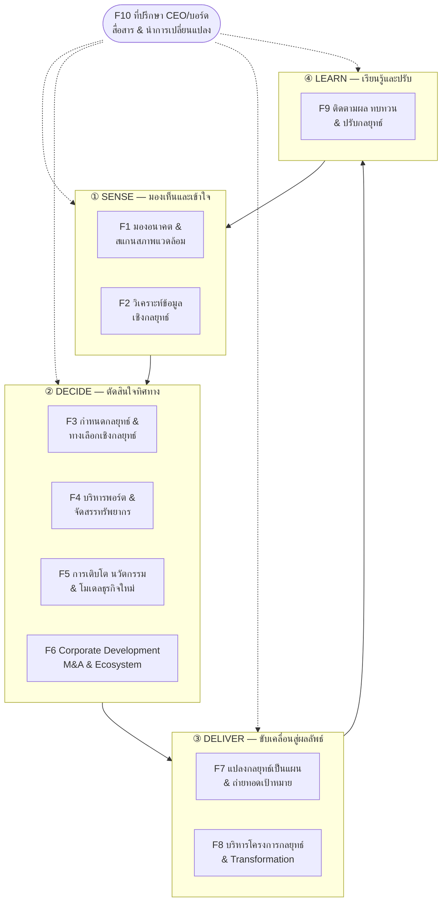

# หน้าที่งานหลักของนักกลยุทธ์องค์กร (Corporate Strategist Core Functions)

> **วัตถุประสงค์ของเอกสาร**
> เอกสารนี้เป็น "ฐานความรู้ตั้งต้น" ของ Repo งานกลยุทธ์ ใช้สำหรับ
> 1. ทำความเข้าใจขอบเขตหน้าที่งานของนักกลยุทธ์องค์กร / สำนักกลยุทธ์ (Strategy Office) อย่างเป็นระบบ
> 2. เป็นฐานในการออกแบบระบบ **Agentic AI** ที่จะช่วยทำงานกลยุทธ์ในแต่ละหน้าที่
> 3. เชื่อมโยงกับทิศทางขององค์กรที่ต้องเปลี่ยนผ่านจาก **Industrial → Platform → Ecosystem Capitalism** สู่ **Agentic AI Organization**

---

## สารบัญ

1. [นักกลยุทธ์องค์กรคือใคร ทำไปเพื่ออะไร](#1-นักกลยุทธ์องค์กรคือใคร-ทำไปเพื่ออะไร)
2. [กรอบอ้างอิงหลักที่ใช้ในการศึกษา](#2-กรอบอ้างอิงหลักที่ใช้ในการศึกษา)
3. [ภาพรวม 10 หน้าที่งานหลัก](#3-ภาพรวม-10-หน้าที่งานหลัก)
4. [รายละเอียดแต่ละหน้าที่งาน](#4-รายละเอียดแต่ละหน้าที่งาน)
5. [ปฏิทินงานกลยุทธ์ตลอดปี](#5-ปฏิทินงานกลยุทธ์ตลอดปี-strategy-calendar)
6. [บทบาท 4 แบบของนักกลยุทธ์](#6-บทบาท-4-แบบของนักกลยุทธ์-strategist-archetypes)
7. [สมรรถนะที่นักกลยุทธ์ต้องมี](#7-สมรรถนะที่นักกลยุทธ์ต้องมี-competency-model)
8. [หน้าที่ของนักกลยุทธ์เปลี่ยนไปอย่างไรตามเส้นทาง Transformation](#8-หน้าที่ของนักกลยุทธ์เปลี่ยนไปอย่างไรตามเส้นทาง-transformation)
9. [ข้อค้นพบจากผลสำรวจล่าสุด](#9-ข้อค้นพบจากผลสำรวจล่าสุด)
10. [นัยต่อการออกแบบระบบ Agentic AI งานกลยุทธ์](#10-นัยต่อการออกแบบระบบ-agentic-ai-งานกลยุทธ์)
11. [แหล่งอ้างอิง](#11-แหล่งอ้างอิง)

---

## 1. นักกลยุทธ์องค์กรคือใคร ทำไปเพื่ออะไร

**นักกลยุทธ์องค์กร (Corporate Strategist)** หมายรวมถึง Chief Strategy Officer (CSO), ทีม Corporate Strategy, Strategy Office / Office of Strategy Management (OSM) และทีม Transformation Office ที่ทำหน้าที่ใกล้เคียงกัน

แก่นของงานคือการช่วยผู้นำสูงสุด (CEO/บอร์ด) ตอบ **4 คำถามใหญ่** ขององค์กรอย่างต่อเนื่อง

| # | คำถาม | ความหมาย |
|---|-------|---------|
| 1 | **เราอยู่ตรงไหน?** (Where are we now?) | เข้าใจสภาพแวดล้อม ตลาด คู่แข่ง และขีดความสามารถของตนเองอย่างตรงไปตรงมา |
| 2 | **เราจะไปที่ไหน?** (Where do we want to go?) | กำหนดทิศทาง ความทะเยอทะยาน และ "ทางเลือก" ว่าจะเล่นที่ไหน จะชนะอย่างไร |
| 3 | **เราจะไปถึงได้อย่างไร?** (How do we get there?) | แปลงกลยุทธ์เป็นแผน โครงการ งบประมาณ และเป้าหมายที่ทุกคนเข้าใจตรงกัน |
| 4 | **เรากำลังไปถูกทางหรือไม่?** (Are we on track?) | ติดตามผล เรียนรู้ และปรับกลยุทธ์เมื่อโลกเปลี่ยน |

> **หลักคิดสำคัญ:** กลยุทธ์ที่ดีไม่ใช่ "เป้าหมายสวย ๆ" แต่คือ **การเลือก** (choice) ว่าจะทำอะไรและ *จะไม่ทำอะไร*
> Richard Rumelt สรุปแก่นของกลยุทธ์ที่ดีไว้ 3 ส่วน คือ (1) **การวินิจฉัย** ปัญหา/ความท้าทายที่แท้จริง (2) **นโยบายนำทาง** (guiding policy) และ (3) **ชุดการกระทำที่สอดประสานกัน** (coherent actions)

---

## 2. กรอบอ้างอิงหลักที่ใช้ในการศึกษา

| กรอบคิด | เจ้าของ | ใช้ตอบอะไร |
|---------|--------|-----------|
| **Execution Premium Process (XPP)** 6 ขั้น และ **Office of Strategy Management (OSM)** | Kaplan & Norton (2005, 2008) | วงจรบริหารกลยุทธ์ครบวงจร: พัฒนากลยุทธ์ → แปลงเป็นแผน → จัดองค์กรให้สอดคล้อง → วางแผนปฏิบัติการ → ติดตามและเรียนรู้ → ทดสอบและปรับ |
| **4 บทบาทของ CSO** | Powell & Angwin (2012) | นักกลยุทธ์ทำงานแบบใด: ที่ปรึกษาภายใน / ผู้เชี่ยวชาญ / โค้ช / ผู้นำการเปลี่ยนแปลง |
| **Good Strategy / Bad Strategy** (Kernel of Strategy) | Rumelt (2011) | เกณฑ์ตรวจคุณภาพของกลยุทธ์ |
| **Playing to Win** (Strategic Choice Cascade) | Lafley & Martin (2013) | 5 คำถามเชิงเลือก: Winning Aspiration → Where to Play → How to Win → Capabilities → Management Systems |
| **Strategy Beyond the Hockey Stick** | Bradley, Hirt & Smit / McKinsey (2018) | การจัดสรรทรัพยากรแบบกล้าเปลี่ยน (dynamic reallocation) และการลด "social side of strategy" |
| **Platform Capitalism** | Srnicek (2016) | ตรรกะของธุรกิจแพลตฟอร์ม ข้อมูล และ network effects |
| **Ecosystem Strategy** | Adner (2012, 2021); Jacobides, Cennamo & Gawer (2018) | การออกแบบและบริหาร ecosystem, บทบาท orchestrator vs complementor |

**ความเชื่อมโยงระหว่าง XPP กับหน้าที่งาน 10 ด้านในเอกสารนี้**

| ขั้นของ XPP (Kaplan & Norton) | หน้าที่งานที่เกี่ยวข้อง (หัวข้อ 3) |
|---|---|
| 1. Develop the Strategy | F1, F2, F3, F5, F6 |
| 2. Plan / Translate the Strategy | F4, F7 |
| 3. Align the Organization | F7, F10 |
| 4. Plan Operations | F7, F8 |
| 5. Monitor and Learn | F8, F9 |
| 6. Test and Adapt the Strategy | F9, F1 |

---

## 3. ภาพรวม 10 หน้าที่งานหลัก

จัดกลุ่มเป็นวงจร **Sense → Decide → Deliver → Learn** โดยมีงานที่ปรึกษาผู้บริหารและการสื่อสารเป็นแกนกลาง

### ตารางสรุป

| รหัส | หน้าที่งาน | คำถามหลักที่ตอบ | ผลผลิตหลัก | รอบเวลา | ศักยภาพ Agentic AI |
|---|---|---|---|---|---|
| **F1** | Strategic Foresight & Environmental Scanning | โลกกำลังเปลี่ยนไปอย่างไร จะกระทบเราอย่างไร | Trend radar, Scenario, Early-warning signals | ต่อเนื่อง + ทบทวนใหญ่รายปี | 🟢 สูง |
| **F2** | Strategic Intelligence & Analysis | ตลาด ลูกค้า คู่แข่ง และตัวเราอยู่ตรงไหน | Market/Competitor brief, Capability assessment, Fact base | ต่อเนื่อง + ตามรอบวางแผน | 🟢 สูง |
| **F3** | Strategy Formulation | เราจะเล่นที่ไหน และจะชนะอย่างไร | Vision/Aspiration, Strategic choices, Strategy document | ทุก 3–5 ปี + refresh รายปี | 🟡 กลาง (AI ร่าง/ทดสอบ คนเลือก) |
| **F4** | Portfolio & Resource Allocation | ควรลงเงิน/คน/เวลาไปที่ไหน เท่าไร | Portfolio review, Capital allocation plan, Investment cases | รายปี + ตามเหตุการณ์ | 🟡 กลาง |
| **F5** | Growth, Innovation & Business Model | S-curve ถัดไปของเราคืออะไร | Growth agenda, New business model, Venture pipeline | ต่อเนื่อง | 🟡 กลาง |
| **F6** | Corporate Development, M&A, Partnership & Ecosystem | ควรซื้อ ร่วมทุน จับมือกับใคร | Target screening, Deal thesis, Partner/Ecosystem map | ตามโอกาส | 🟡 กลาง |
| **F7** | Strategic Planning, Translation & Alignment | ทุกหน่วยงานจะเดินไปทางเดียวกันอย่างไร | Strategy map, BSC/OKR, Corporate plan, Budget link | รายปี | 🟢 สูง |
| **F8** | Strategic Initiative & Transformation Management | โครงการสำคัญเดินหน้าตามแผนหรือไม่ | Initiative portfolio, Roadmap, Status/Risk report | รายสัปดาห์–รายเดือน | 🟢 สูง |
| **F9** | Performance Monitoring, Review & Adaptation | ผลลัพธ์ได้ตามเป้าหรือไม่ กลยุทธ์ยังถูกอยู่ไหม | Dashboard, Quarterly strategy review pack, Adaptation decisions | รายเดือน–รายไตรมาส | 🟢 สูง |
| **F10** | CEO/Board Advisory, Communication & Change Leadership | ผู้นำและพนักงานเข้าใจ เชื่อ และลงมือหรือไม่ | Board pack, Strategy narrative, Change plan | ต่อเนื่อง | 🟡 กลาง (ความสัมพันธ์ยังเป็นของคน) |

---

## 4. รายละเอียดแต่ละหน้าที่งาน

> แต่ละหน้าที่อธิบายด้วยโครงสร้างเดียวกัน: **เป้าหมาย → กิจกรรมหลัก → เครื่องมือ → ผลผลิต → ผู้เกี่ยวข้อง → การแบ่งงาน AI กับมนุษย์**

### ① SENSE — มองเห็นและเข้าใจ

#### F1. การมองอนาคตและสแกนสภาพแวดล้อม (Strategic Foresight & Environmental Scanning)

- **เป้าหมาย:** รู้ก่อน เห็นก่อน เตรียมตัวก่อน ต่อการเปลี่ยนแปลงภายนอกที่จะกระทบองค์กรใน 3–10 ปี
- **กิจกรรมหลัก**
  - ติดตาม Megatrends และแนวโน้มอุตสาหกรรม (เทคโนโลยี, AI, กฎระเบียบ, ESG, ภูมิรัฐศาสตร์, ประชากร)
  - จับ "สัญญาณอ่อน" (weak signals) และ disruption ที่อาจเกิดขึ้น
  - จัดทำ Scenario Planning (ฉากทัศน์อนาคต 3–4 แบบ) และระบุ "สัญญาณเตือน" ของแต่ละฉากทัศน์
  - ประเมินผลกระทบต่อโมเดลธุรกิจปัจจุบัน
- **เครื่องมือ:** PESTEL, Megatrend analysis, Horizon scanning, Scenario planning, Three Horizons (H1/H2/H3), Futures wheel
- **ผลผลิต:** Trend radar, Scenario report, Early-warning indicator list, Strategic issue brief
- **ผู้เกี่ยวข้อง:** CEO, บอร์ด, ฝ่ายนวัตกรรม, R&D, ฝ่ายบริหารความเสี่ยง
- **AI ทำได้:** สแกนข่าว รายงานวิจัย สิทธิบัตร นโยบายรัฐ ตลอด 24 ชม. / จัดกลุ่มสัญญาณ / ร่าง scenario / แจ้งเตือนเมื่อสัญญาณเปลี่ยน
- **มนุษย์ต้องทำ:** ตีความว่า "สิ่งนี้มีความหมายอะไรต่อเรา" / เลือกฉากทัศน์ที่จะใช้วางแผน / ทำให้ผู้บริหารยอมรับสัญญาณที่ไม่อยากได้ยิน

#### F2. การวิเคราะห์ข้อมูลเชิงกลยุทธ์ (Strategic Intelligence & Analysis)

- **เป้าหมาย:** สร้าง "Fact base" ที่เชื่อถือได้ เป็นฐานของการตัดสินใจเชิงกลยุทธ์ทั้งหมด
- **กิจกรรมหลัก**
  - **ภายนอก:** วิเคราะห์ตลาด ขนาดและการเติบโต, Customer insight, Competitor intelligence, Benchmarking
  - **ภายใน:** วิเคราะห์ผลประกอบการ, ห่วงโซ่คุณค่า, ขีดความสามารถหลัก (core capabilities), ทุนมนุษย์และวัฒนธรรม
  - สังเคราะห์เป็น "Strategic issues" ที่องค์กรต้องตอบ
- **เครื่องมือ:** Five Forces, Value Chain, VRIO, SWOT/TOWS, Customer Jobs-to-be-Done, Financial ratio & driver tree, Benchmarking
- **ผลผลิต:** Market & competitor brief, Capability assessment, Fact pack, Strategic issue list
- **ผู้เกี่ยวข้อง:** การเงิน, การตลาด, ขาย, HR, ทุกหน่วยธุรกิจ, Data/Analytics team
- **AI ทำได้:** รวบรวมและทำความสะอาดข้อมูล / วิเคราะห์ตัวเลข / ทำ competitor profile อัตโนมัติ / ร่าง SWOT พร้อมแหล่งอ้างอิง
- **มนุษย์ต้องทำ:** ตั้งคำถามที่ถูกต้อง / ตรวจสอบความน่าเชื่อถือของข้อมูล / เห็น insight ที่ข้อมูลไม่ได้บอกตรง ๆ

### ② DECIDE — ตัดสินใจทิศทาง

#### F3. การกำหนดกลยุทธ์และทางเลือกเชิงกลยุทธ์ (Strategy Formulation)

- **เป้าหมาย:** ได้ทิศทางและ "ทางเลือก" ที่ชัดเจน ซึ่งผู้นำเห็นพ้องและพร้อมผูกมัด
- **กิจกรรมหลัก**
  - ทบทวน Purpose, Vision, Mission และ Winning Aspiration
  - สร้างทางเลือกเชิงกลยุทธ์หลายทาง (strategic options) และประเมินเปรียบเทียบ
  - ตอบคำถาม **Where to Play / How to Win** และระบุ capabilities ที่ต้องสร้าง
  - ออกแบบและอำนวยการ Strategy Retreat / Workshop ของผู้บริหาร
  - ทดสอบกลยุทธ์ (stress test / red team) กับฉากทัศน์จาก F1
- **เครื่องมือ:** Playing to Win cascade, Strategy Kernel (Rumelt), Ansoff Matrix, Blue Ocean, Business Model Canvas, Option evaluation matrix, McKinsey's 10 timeless tests of strategy
- **ผลผลิต:** Corporate strategy document (3–5 ปี), Strategic themes / pillars, Strategic objectives
- **ผู้เกี่ยวข้อง:** CEO, คณะผู้บริหาร, บอร์ด
- **AI ทำได้:** ร่างทางเลือกหลายแบบ / จำลองผลลัพธ์ทางการเงิน / ทำ red-team ท้าทายสมมติฐาน / ตรวจความสอดคล้องของกลยุทธ์
- **มนุษย์ต้องทำ:** **การเลือกและการแลก (trade-off)** / การสร้างฉันทามติในทีมผู้บริหาร / ความรับผิดชอบต่อผลลัพธ์

#### F4. การบริหารพอร์ตและจัดสรรทรัพยากร (Portfolio Management & Resource Allocation)

- **เป้าหมาย:** ให้เงิน คน และเวลาผู้บริหาร ไหลไปยังโอกาสที่สร้างมูลค่าสูงสุดตามกลยุทธ์ (ไม่ใช่ตามความเคยชิน)
- **กิจกรรมหลัก**
  - ทบทวนพอร์ตธุรกิจ/ผลิตภัณฑ์: จะลงทุนเพิ่ม รักษา ปรับโครงสร้าง หรือถอนตัว
  - จัดลำดับความสำคัญของการลงทุนและโครงการ (capital allocation)
  - สมดุลระหว่างธุรกิจปัจจุบันกับธุรกิจอนาคต (H1/H2/H3)
  - ผลักดันการโยกย้ายทรัพยากรแบบ dynamic — งานวิจัยของ McKinsey ชี้ว่าบริษัทที่โยกงบลงทุนข้ามหน่วยธุรกิจได้มากกว่ามีแนวโน้มสร้างผลตอบแทนสูงกว่า
- **เครื่องมือ:** BCG Matrix, GE-McKinsey Matrix, Three Horizons, NPV/IRR, Real options, Portfolio heatmap
- **ผลผลิต:** Portfolio review, Capital allocation plan, Investment committee papers
- **ผู้เกี่ยวข้อง:** CFO, คณะกรรมการลงทุน, หัวหน้าหน่วยธุรกิจ
- **AI ทำได้:** สร้าง financial model / วิเคราะห์ sensitivity / เสนอสัดส่วนการจัดสรรตามหลายเงื่อนไข
- **มนุษย์ต้องทำ:** ตัดสินใจเรื่องที่กระทบคนและอำนาจภายในองค์กร (ซึ่งเป็นส่วนที่ยากที่สุด)

#### F5. การเติบโต นวัตกรรม และโมเดลธุรกิจใหม่ (Growth, Innovation & Business Model)

- **เป้าหมาย:** สร้าง "S-curve ถัดไป" ก่อนที่ธุรกิจหลักจะอิ่มตัว
- **กิจกรรมหลัก**
  - กำหนด Growth agenda: เติบโตจากธุรกิจเดิม ตลาดใหม่ หรือโมเดลธุรกิจใหม่
  - ออกแบบโมเดลธุรกิจ **Platform** และ **Ecosystem** (สำคัญมากต่อทิศทางขององค์กร)
  - บริหาร innovation pipeline / corporate venture / incubation
  - ทดลองแบบ Lean (hypothesis → MVP → learn) ก่อนลงทุนใหญ่
- **เครื่องมือ:** Business Model Canvas, Platform Design Canvas, Lean Startup, Stage-gate, Innovation accounting
- **ผลผลิต:** Growth agenda, New business model blueprint, Venture pipeline report
- **ผู้เกี่ยวข้อง:** ทีมนวัตกรรม, Digital, หน่วยธุรกิจ, พันธมิตรภายนอก
- **AI ทำได้:** สร้างไอเดียโมเดลธุรกิจ / ค้นหา use case ในอุตสาหกรรมอื่น / ประเมินขนาดตลาดเบื้องต้น
- **มนุษย์ต้องทำ:** ตัดสินใจเดิมพัน / ปกป้องธุรกิจใหม่จากแรงต้านของธุรกิจเดิม

#### F6. Corporate Development, M&A, Partnership และ Ecosystem

- **เป้าหมาย:** เร่งการเติบโตและเติมขีดความสามารถด้วยการเติบโตแบบ inorganic และการเป็นพันธมิตร
- **กิจกรรมหลัก**
  - กำหนด M&A / Partnership thesis ที่สอดคล้องกับกลยุทธ์
  - คัดกรองและประเมินเป้าหมาย (target screening, due diligence ร่วมกับฝ่ายการเงิน/กฎหมาย)
  - ออกแบบ Joint venture, Strategic alliance, Corporate venture capital
  - **วาดแผนที่ Ecosystem:** ใครคือ partner, complementor, คู่แข่ง และผู้กำหนดกติกา
  - กำหนดบทบาทของเราใน ecosystem (Orchestrator หรือ Complementor) และกติกาการแบ่งคุณค่า
  - บริหาร Post-merger integration (PMI) ร่วมกับ HR
- **เครื่องมือ:** Deal screening criteria, Synergy model, Adner's Value Blueprint, Ecosystem map, Partnership governance model
- **ผลผลิต:** Deal pipeline, Investment memo, Ecosystem map, Partnership playbook
- **ผู้เกี่ยวข้อง:** CEO, CFO, กฎหมาย, HR (PMI/วัฒนธรรม), พันธมิตรภายนอก
- **AI ทำได้:** ค้นหาและคัดกรองบริษัทเป้าหมาย / สรุปข้อมูล due diligence / ทำแผนที่ ecosystem จากข้อมูลสาธารณะ
- **มนุษย์ต้องทำ:** การเจรจา ความไว้วางใจ และความสัมพันธ์กับพันธมิตร

### ③ DELIVER — ขับเคลื่อนสู่ผลลัพธ์

#### F7. การแปลงกลยุทธ์เป็นแผนและการถ่ายทอดเป้าหมาย (Strategic Planning, Translation & Alignment)

- **เป้าหมาย:** ให้กลยุทธ์ "ลงมือได้" และทุกหน่วยงาน ทุกคน เดินไปทางเดียวกัน
- **กิจกรรมหลัก**
  - แปลงกลยุทธ์เป็น Strategy Map, วัตถุประสงค์, ตัวชี้วัด (KPI/OKR), เป้าหมาย และโครงการ
  - จัดทำแผนธุรกิจ/แผนวิสาหกิจ (Corporate Plan) และ **เชื่อมกลยุทธ์เข้ากับงบประมาณ**
  - ถ่ายทอดเป้าหมาย (cascade) จากองค์กร → หน่วยงาน → บุคคล
  - **เชื่อมกับระบบ HR:** Performance management, Strategic Workforce Planning, Capability building
  - ตรวจสอบความสอดคล้อง (alignment) ระหว่างแผนของหน่วยงานต่าง ๆ
- **เครื่องมือ:** Balanced Scorecard, Strategy Map, OKR, Hoshin Kanri (Catchball), Strategic Workforce Planning
- **ผลผลิต:** Corporate plan, Strategy map & scorecard, KPI/OKR dictionary, Unit plans, Strategic budget
- **ผู้เกี่ยวข้อง:** ทุกหน่วยงาน, การเงิน (งบประมาณ), HR (ระบบประเมินผล)
- **AI ทำได้:** ร่าง strategy map / แนะนำ KPI ที่สอดคล้อง / ตรวจหาช่องว่างหรือความซ้ำซ้อนของแผนหน่วยงาน / ตรวจ alignment อัตโนมัติ
- **มนุษย์ต้องทำ:** การเจรจาตั้งเป้า (target setting) และการผูกมัดของหัวหน้าหน่วยงาน

#### F8. การบริหารโครงการกลยุทธ์และ Transformation (Strategic Initiative & Transformation Management)

- **เป้าหมาย:** ทำให้โครงการเชิงกลยุทธ์ (โดยเฉพาะที่ข้ามหน่วยงาน) เกิดผลจริง ไม่ติดอยู่ในแผน
- **กิจกรรมหลัก**
  - บริหาร Portfolio ของโครงการกลยุทธ์ (Strategy/Transformation Management Office — SMO/TMO)
  - จัดลำดับความสำคัญ กำหนด owner, milestone, งบประมาณ และตัวชี้วัดผลลัพธ์ (benefit)
  - ติดตามความคืบหน้า ความเสี่ยง และอุปสรรค และยกระดับปัญหา (escalation) สู่ผู้บริหาร
  - ติดตามการได้ผลประโยชน์จริง (benefit realization) ไม่ใช่แค่ "ทำเสร็จ"
- **เครื่องมือ:** Initiative charter, Roadmap, RAID log, Stage-gate, Benefit tracking, Portfolio dashboard
- **ผลผลิต:** Initiative portfolio, Transformation roadmap, Weekly/Monthly status & risk report
- **ผู้เกี่ยวข้อง:** Initiative owners, PMO, คณะกรรมการขับเคลื่อน (Steering Committee)
- **AI ทำได้:** รวบรวมสถานะอัตโนมัติ / ตรวจจับโครงการที่เสี่ยงล่าช้า / ร่างรายงาน / ติดตาม action items จากที่ประชุม
- **มนุษย์ต้องทำ:** ปลดล็อกปัญหาข้ามหน่วยงาน / ตัดสินใจหยุดหรือปรับโครงการ

### ④ LEARN — เรียนรู้และปรับ

#### F9. การติดตามผล ทบทวน และปรับกลยุทธ์ (Performance Monitoring, Strategy Review & Adaptation)

- **เป้าหมาย:** รู้เร็วว่าเดินถูกทางหรือไม่ และกล้าปรับเมื่อสมมติฐานเปลี่ยน
- **กิจกรรมหลัก**
  - ติดตามตัวชี้วัดเชิงกลยุทธ์ (leading + lagging indicators)
  - จัด **Strategy Review Meeting** รายไตรมาส (แยกจากการประชุมผลประกอบการรายเดือน)
  - วิเคราะห์ส่วนต่างจากเป้า (variance) และหาสาเหตุราก
  - **ทดสอบสมมติฐานของกลยุทธ์** (strategy hypothesis testing) — ยังจริงอยู่หรือไม่
  - เสนอการปรับกลยุทธ์ / ปรับเป้า / ปรับทรัพยากร
- **เครื่องมือ:** Strategic dashboard, Balanced Scorecard review, Variance & driver analysis, After-Action Review, Assumption log
- **ผลผลิต:** Monthly dashboard, Quarterly strategy review pack, Annual strategy performance report, Adaptation decisions log
- **ผู้เกี่ยวข้อง:** CEO, คณะผู้บริหาร, บอร์ด, การเงิน
- **AI ทำได้:** สร้าง dashboard และรายงานอัตโนมัติ / วิเคราะห์ variance / แจ้งเตือนเมื่อสมมติฐานเริ่มไม่เป็นจริง / ร่าง review pack
- **มนุษย์ต้องทำ:** การสนทนาเชิงกลยุทธ์ที่ตรงไปตรงมา / ตัดสินใจปรับทิศทาง

### ⑤ แกนกลาง (Cross-cutting)

#### F10. ที่ปรึกษา CEO/บอร์ด การสื่อสาร และการนำการเปลี่ยนแปลง (Advisory, Communication & Change Leadership)

- **เป้าหมาย:** ทำให้ผู้นำตัดสินใจได้ดีขึ้น และทำให้คนทั้งองค์กร "เข้าใจ – เชื่อ – ลงมือ"
- **กิจกรรมหลัก**
  - เป็นที่ปรึกษา/คู่คิดของ CEO ในเรื่องเชิงกลยุทธ์และโครงการพิเศษ
  - เตรียมวาระและเอกสารเชิงกลยุทธ์สำหรับบอร์ด (board strategy session, board pack)
  - สร้าง Strategy narrative / storytelling ให้คนทุกระดับเข้าใจ "ทำไม – อะไร – อย่างไร"
  - ออกแบบและนำการเปลี่ยนแปลงร่วมกับ HR (change management, culture, engagement)
  - เชื่อมโยงกับการบริหารความเสี่ยงองค์กร (ERM) และการกำกับดูแลที่ดี
- **เครื่องมือ:** Pyramid Principle, Strategy on a page, Kotter's 8 Steps, ADKAR, Stakeholder map, Change readiness assessment
- **ผลผลิต:** Board pack, CEO briefing, Strategy communication plan, Change roadmap
- **ผู้เกี่ยวข้อง:** CEO, บอร์ด, Corporate Communications, HR, ผู้นำทุกระดับ
- **AI ทำได้:** ร่างเอกสารบอร์ด / สรุปประเด็น / ปรับสารให้เหมาะกับแต่ละกลุ่มผู้ฟัง / วิเคราะห์ความรู้สึกพนักงานจากแบบสำรวจ
- **มนุษย์ต้องทำ:** ความไว้วางใจ อิทธิพล และการเมืองในองค์กร — **นี่คือส่วนที่ AI ทดแทนได้น้อยที่สุด**

---

## 5. ปฏิทินงานกลยุทธ์ตลอดปี (Strategy Calendar)

ตัวอย่างสำหรับองค์กรที่ใช้ปีบัญชี ม.ค.–ธ.ค. (ปรับตามรอบปีบัญชีจริงขององค์กร)

| ช่วงเวลา | งานหลักของนักกลยุทธ์ | หน้าที่งาน |
|---|---|---|
| **Q1** (ม.ค.–มี.ค.) | สรุปผลการดำเนินงานปีก่อน, Kick-off แผนปีใหม่และสื่อสารกลยุทธ์ทั่วองค์กร, เริ่มติดตามโครงการ | F9, F10, F8 |
| **Q2** (เม.ย.–มิ.ย.) | สแกนสภาพแวดล้อมรอบใหม่, วิเคราะห์เชิงลึก, เตรียม fact base และ strategic issues สำหรับ retreat, ทบทวนกลยุทธ์กลางปี | F1, F2, F9 |
| **Q3** (ก.ค.–ก.ย.) | **Strategy Retreat** ผู้บริหาร/บอร์ด, ทบทวน/ปรับกลยุทธ์ 3–5 ปี, ทบทวนพอร์ตและลำดับการลงทุน, เริ่มกระบวนการงบประมาณ | F3, F4, F5, F6 |
| **Q4** (ต.ค.–ธ.ค.) | จัดทำแผนธุรกิจและงบประมาณปีถัดไป, กำหนด KPI/OKR และถ่ายทอดสู่หน่วยงาน/บุคคล (ผูกกับระบบ Performance ของ HR), เสนอบอร์ดอนุมัติ | F7, F4, F10 |
| **รายสัปดาห์–รายเดือน** | ติดตามโครงการกลยุทธ์, Dashboard ตัวชี้วัด, เฝ้าระวังสัญญาณเตือน | F8, F9, F1 |
| **รายไตรมาส** | Strategy Review Meeting, รายงานบอร์ด | F9, F10 |
| **ตามเหตุการณ์** | โอกาส M&A/พันธมิตร, วิกฤต/การเปลี่ยนแปลงฉับพลัน, โครงการพิเศษของ CEO | F6, F3, F10 |

> 💡 **ข้อสังเกต:** ขณะนี้ (ต.ค.) องค์กรส่วนใหญ่อยู่ในช่วงทำแผนและงบประมาณปีถัดไป (Q4) ซึ่งเป็นช่วงที่เหมาะในการนำ Agentic AI เข้ามาช่วยงาน F7 (ตรวจ alignment ของแผนหน่วยงาน) และเตรียมระบบ F8/F9 สำหรับปีหน้า

---

## 6. บทบาท 4 แบบของนักกลยุทธ์ (Strategist Archetypes)

งานวิจัยของ Powell & Angwin (2012) ที่สัมภาษณ์ CSO ของบริษัทใน FTSE 100 จำนวน 24 คน พบว่าบทบาทของนักกลยุทธ์แบ่งได้ด้วย 2 มิติ

- **มิติที่ 1:** โฟกัสที่ *การกำหนดกลยุทธ์* (Formulation) หรือ *การนำไปปฏิบัติ* (Execution)
- **มิติที่ 2:** *ลงมือทำเอง/ควบคุมกระบวนการ* หรือ *อำนวยความสะดวกให้หน่วยธุรกิจทำ*

| | **ลงมือทำเอง / ทำงานใกล้ CEO** | **อำนวยความสะดวก / ทำงานในหน่วยธุรกิจ** |
|---|---|---|
| **Formulation** | **Internal Consultant** — ที่ปรึกษาภายใน คิดและร่างกลยุทธ์เองเหมือนที่ปรึกษาภายนอก | **Coach** — โค้ช ช่วยให้หน่วยธุรกิจคิดกลยุทธ์ของตัวเอง พร้อมข้อมูลและเครือข่าย |
| **Execution** | **Specialist** — ผู้เชี่ยวชาญเฉพาะ (เช่น M&A, กฎระเบียบ) ทำงานกับ CEO โดยตรง | **Change Agent** — ผู้นำการเปลี่ยนแปลง ขับเคลื่อนการปฏิบัติจากภายในหน่วยธุรกิจ |

**นัยต่อองค์กรที่กำลัง Transform:**
ในช่วงเปลี่ยนผ่านสู่ Platform/Ecosystem และ Agentic AI Organization นักกลยุทธ์มักต้อง **สลับบทบาทได้ทั้ง 4 แบบ** แต่บทบาทที่ต้องเสริมมากที่สุดคือ **Change Agent** (เพราะ transformation ล้มเหลวที่การปฏิบัติ) และ **Coach** (เพราะองค์กรแบบ ecosystem ต้องการให้หน่วยงานคิดเชิงกลยุทธ์ได้เอง) ขณะที่งานแบบ Internal Consultant (วิเคราะห์ ร่างเอกสาร) จะถูก Agentic AI รับไปทำได้มากขึ้นเรื่อย ๆ

---

## 7. สมรรถนะที่นักกลยุทธ์ต้องมี (Competency Model)

ใช้เป็นฐานในการสรรหา พัฒนา และประเมินทีมกลยุทธ์ได้ (เชื่อมกับงาน HR)

| กลุ่มสมรรถนะ | สมรรถนะย่อย | ความสำคัญในยุค Agentic AI |
|---|---|---|
| **การคิด** | Systems thinking, Critical thinking, Hypothesis-driven problem solving, Foresight | ⬆️ เพิ่มขึ้น — ต้องตั้งคำถามและตรวจสอบผลงานของ AI ได้ |
| **ความรู้ธุรกิจ** | Business & financial acumen, Industry knowledge, Business model design (Platform/Ecosystem) | ⬆️ เพิ่มขึ้น — ต้องเข้าใจโมเดลธุรกิจแบบใหม่ |
| **การวิเคราะห์** | Data analysis, Financial modeling, Research | ➡️ เปลี่ยนรูป — AI ทำส่วนใหญ่ คนต้อง "กำกับและตรวจสอบ" |
| **การโน้มน้าวและสื่อสาร** | Storytelling, Executive communication, Facilitation, Influence without authority | ⬆️ เพิ่มขึ้นมาก — เป็นจุดที่คนสร้างมูลค่าได้ชัดที่สุด |
| **การขับเคลื่อน** | Change leadership, Program management, Stakeholder management | ⬆️ เพิ่มขึ้น |
| **ความร่วมมือ** | Partnership & ecosystem orchestration, Negotiation | ⬆️ เพิ่มขึ้นมาก — หัวใจของ Ecosystem Capitalism |
| **ดิจิทัลและ AI** | Data & AI literacy, การออกแบบ workflow ร่วมกับ AI agents, AI governance | 🆕 ใหม่และจำเป็น |

---

## 8. หน้าที่ของนักกลยุทธ์เปลี่ยนไปอย่างไรตามเส้นทาง Transformation

| มิติ | Industrial Capitalism | Platform Capitalism | Ecosystem Capitalism | Agentic AI Organization (ปลายทาง) |
|---|---|---|---|---|
| **หน่วยของการวิเคราะห์** | บริษัทและห่วงโซ่คุณค่า (value chain) | แพลตฟอร์มและเครือข่ายผู้ใช้หลายฝั่ง | เครือข่ายคุณค่า (value network) ของพันธมิตร | ระบบคน + AI agents ทั้งในและนอกองค์กร |
| **แหล่งความได้เปรียบ** | ขนาด ประสิทธิภาพ การเป็นเจ้าของสินทรัพย์ | Network effects, ข้อมูล, ฐานผู้ใช้ | การ orchestrate, มาตรฐานร่วม, ความไว้วางใจ | ความเร็วของวงจร Sense–Decide–Act, ข้อมูลและ workflow เฉพาะขององค์กร |
| **ตรรกะการสร้างคุณค่า** | Pipeline: ผลิต → ขาย แบบเส้นตรง | Matchmaking: เชื่อมผู้ซื้อกับผู้ขาย/ผู้ให้กับผู้รับ | Co-creation: สร้างคุณค่าร่วมกับพันธมิตร | Autonomous value creation: agent ทำงานแทน/ร่วมกับคนแบบต่อเนื่อง |
| **คำถามกลยุทธ์หลัก** | เราจะแข่งขันในอุตสาหกรรมนี้อย่างไร | เราจะเชื่อมใครกับใคร และจุดติด network effects อย่างไร | ใครต้องร่วมมือกับเรา เราควรเป็น orchestrator หรือ complementor | งานใดให้ agent ทำ งานใดคนตัดสินใจ และจะกำกับดูแลอย่างไร |
| **ตัวชี้วัดตัวอย่าง** | Margin, Market share, Utilization, ROA | Active users, GMV, Liquidity, Take rate, CAC/LTV | Ecosystem value share, จำนวนและความภักดีของพันธมิตร, รายได้จาก co-innovation | Decision cycle time, % งานที่ agent ทำได้อัตโนมัติ, มูลค่าต่อพนักงาน |
| **รอบการวางแผน** | แผน 3–5 ปีแบบตายตัว + งบรายปี | Rolling plan รายไตรมาส + การทดลองต่อเนื่อง | Adaptive, ปรับตามการเปลี่ยนแปลงของ ecosystem | Continuous strategy: sensing และ monitoring ตลอดเวลา |
| **บทบาทนักกลยุทธ์** | **Planner / Controller** — วางแผนและควบคุม | **Architect** — ออกแบบแพลตฟอร์มและโมเดลธุรกิจ | **Orchestrator / Diplomat** — ประสานพันธมิตรและกติกา | **Strategy System Designer** — ออกแบบระบบกลยุทธ์ที่คนและ AI ทำงานร่วมกัน |
| **เครื่องมือเด่น** | Five Forces, Value Chain, BCG, BSC | Platform canvas, Network-effect mapping, A/B testing | Ecosystem map, Value Blueprint, Partnership governance | Agent workflow design, AI governance framework, Real-time strategy dashboard |

**ข้อสรุปสำหรับองค์กร**
1. หน้าที่งานหลักทั้ง 10 ด้าน **ยังคงอยู่ครบ** แต่ *เนื้อหา* และ *วิธีทำ* เปลี่ยนไปในแต่ละช่วง
2. งานที่ต้องเสริมเป็นพิเศษในช่วง Platform → Ecosystem คือ **F5 (โมเดลธุรกิจใหม่)** และ **F6 (Ecosystem & Partnership)**
3. งานที่ Agentic AI จะเปลี่ยนวิธีทำมากที่สุดคือ **F1, F2, F7, F8, F9** ซึ่งเปลี่ยนจาก "รอบ" (cycle) เป็น "ต่อเนื่อง" (always-on)
4. งานที่ยังต้องเป็นของคนเป็นหลักคือ **การเลือก (F3, F4), ความสัมพันธ์ (F6, F10) และการนำการเปลี่ยนแปลง (F10)**

---

## 9. ข้อค้นพบจากผลสำรวจล่าสุด

- **Deloitte (2024):** CSO ส่วนใหญ่รายงานตรงต่อ CEO ทำหน้าที่ให้คำปรึกษาโครงการพิเศษ ทำงานข้ามสายงานในการตัดสินใจสำคัญ นำงาน corporate development ติดตามตลาด และ **รับผิดชอบด้านการนำกลยุทธ์ไปปฏิบัติมากขึ้นเรื่อย ๆ**
- **Deloitte Global CSO Survey (ก.พ. 2026):**
  - ประมาณ **2 ใน 3** ของผู้นำด้านกลยุทธ์ *ไม่ได้เป็นเจ้าของ* การตัดสินใจเชิงกลยุทธ์ที่ใหญ่ที่สุด — มีช่องว่างระหว่าง "ความรับผิดชอบ" กับ "อำนาจ"
  - **มากกว่าครึ่ง** บอกว่ามีลำดับความสำคัญมากเกินไปแต่เวลาน้อยเกินไป
  - **51%** คาดว่าจะทำงานร่วมกับ AI มากขึ้น แต่ CSO ส่วนใหญ่ "ใช้ AI แต่ยังไม่ได้นำด้วย AI"
- **McKinsey:** ผู้นำด้านกลยุทธ์ **91%** ดูแลงานอื่นนอกเหนือจากกลยุทธ์ด้วย ที่พบบ่อยคือ ความยั่งยืน ดิจิทัล ข้อมูลและการวิเคราะห์ และงาน Chief of Staff
- **Gartner (2025):** **70%** ของ Chief Data & Analytics Officers (CDAO) เป็นผู้รับผิดชอบหลักด้าน AI strategy และ operating model ขององค์กร → นักกลยุทธ์ต้อง **จับมือกับ CDAO/CIO** ให้ AI strategy ไม่แยกออกจาก corporate strategy
- **Outthinker network:** ทีมกลยุทธ์ต้องจัดการหน้าที่ที่แตกต่างกัน **มากกว่า 20 ด้าน** ตั้งแต่การมองอนาคต การนำ transformation การเติบโต/M&A ไปจนถึงนวัตกรรม

**ความหมายต่อเรา:** ปัญหาใหญ่ของนักกลยุทธ์ในปัจจุบันคือ *งานมาก เวลาน้อย และอำนาจตัดสินใจจำกัด* — Agentic AI จึงมีคุณค่ามากที่สุดเมื่อช่วย **ปลดเวลา** จากงานรวบรวม วิเคราะห์ และติดตาม เพื่อให้นักกลยุทธ์ไปทุ่มเทกับงานที่ต้องใช้วิจารณญาณและอิทธิพล

---

## 10. นัยต่อการออกแบบระบบ Agentic AI งานกลยุทธ์

### 10.1 หลักการแบ่งงานระหว่างคนกับ AI

| AI Agents ทำ (Augment & Automate) | มนุษย์ทำ (Judge & Lead) |
|---|---|
| สแกน รวบรวม จัดระเบียบข้อมูล | ตั้งคำถามที่ถูกต้อง |
| วิเคราะห์ จำลอง สร้างทางเลือก | เลือกและแลก (choice & trade-off) |
| ร่างเอกสาร รายงาน สไลด์ | ผูกมัดทรัพยากรและรับผิดชอบผลลัพธ์ |
| ติดตาม แจ้งเตือน ตรวจความสอดคล้อง | สร้างความไว้วางใจ เจรจา โน้มน้าว |
| ท้าทายสมมติฐาน (red team) | นำการเปลี่ยนแปลงและวัฒนธรรม |

### 10.2 แผนที่ Agent เบื้องต้น (ร่างเพื่อหารือ)

| Agent (ร่าง) | รองรับหน้าที่ | งานตัวอย่าง |
|---|---|---|
| **Foresight & Signal Agent** | F1 | สแกนเทรนด์/ข่าว/นโยบาย, อัปเดต trend radar, แจ้งเตือนสัญญาณสำคัญ |
| **Market & Competitor Intelligence Agent** | F2, F6 | ทำ competitor profile, สรุปความเคลื่อนไหวคู่แข่ง/พันธมิตร, คัดกรองบริษัทเป้าหมาย |
| **Strategy Analyst & Red-Team Agent** | F3, F4, F5 | ร่างทางเลือกเชิงกลยุทธ์, financial model, ท้าทายสมมติฐาน |
| **Planning & Alignment Agent** | F7 | ร่าง strategy map/KPI/OKR, ตรวจ alignment ของแผนหน่วยงาน |
| **Initiative Tracking Agent (AI-PMO)** | F8 | รวบรวมสถานะโครงการ, ตรวจจับความเสี่ยง, ติดตาม action items |
| **Performance Review Agent** | F9 | Dashboard, variance analysis, ร่าง quarterly review pack |
| **Board & Communication Agent** | F10 | ร่าง board pack, strategy narrative, สารสื่อสารสำหรับแต่ละกลุ่ม |

### 10.3 ข้อเสนอขั้นตอนถัดไป

1. **ระบุสภาพปัจจุบัน (As-is):** หน้าที่ใดใน 10 ด้านที่ทีมทำอยู่แล้ว ทำได้ดีแค่ไหน และปฏิทินกลยุทธ์จริงขององค์กรเป็นอย่างไร
2. **เลือกหน้าที่นำร่อง 2–3 ด้าน:** แนะนำให้เริ่มจากด้านที่ *AI ช่วยได้มาก* และ *เป็นภาระงานสูง* เช่น F1 (Foresight), F8 (Initiative Tracking), F9 (Performance Review)
3. **ออกแบบโครงสร้าง Repo:** ฐานความรู้ (knowledge base), เทมเพลตงานกลยุทธ์, และคำสั่ง/ทักษะ (prompts/skills) ของแต่ละ Agent
4. **กำหนดหลัก AI Governance:** ข้อมูลใดใช้ได้ การตัดสินใจใดต้องมีคนอนุมัติ และการอ้างอิงแหล่งที่มา

---

## 11. แหล่งอ้างอิง

**หนังสือและบทความวิชาการ**
- Kaplan, R. S., & Norton, D. P. (2005). *The Office of Strategy Management*. Harvard Business Review. — [HBS Working Knowledge](https://hbswk.hbs.edu/item/the-office-of-strategy-management)
- Kaplan, R. S., & Norton, D. P. (2008). *The Execution Premium: Linking Strategy to Operations for Competitive Advantage*. Harvard Business Press. — [สรุป 6 ขั้นตอนโดย Bernard Marr](https://bernardmarr.com/what-is-the-execution-premium-process-a-summary-of-the-6-steps-to-better-manage-your-strategy/)
- Powell, T. H., & Angwin, D. N. (2012). *The Role of the Chief Strategy Officer*. MIT Sloan Management Review, 54(1). — [MIT SMR](https://shop.sloanreview.mit.edu/the-role-of-the-chief-strategy-officer)
- Rumelt, R. (2011). *Good Strategy / Bad Strategy*. Crown Business.
- Lafley, A. G., & Martin, R. L. (2013). *Playing to Win: How Strategy Really Works*. Harvard Business Review Press.
- Bradley, C., Hirt, M., & Smit, S. (2018). *Strategy Beyond the Hockey Stick*. Wiley.
- Srnicek, N. (2016). *Platform Capitalism*. Polity Press.
- Adner, R. (2012). *The Wide Lens*; Adner, R. (2021). *Winning the Right Game*. MIT Press.
- Jacobides, M. G., Cennamo, C., & Gawer, A. (2018). *Towards a Theory of Ecosystems*. Strategic Management Journal, 39(8).

**ผลสำรวจและรายงาน**
- [Deloitte — 2026 Global Chief Strategy Officer Survey (press release, Feb 2026)](https://www.deloitte.com/us/en/about/press-room/deloitte-2026-chief-strategy-officer-survey.html)
- [Deloitte — Chief Strategy Officer Survey 2026](https://www.deloitte.com/us/en/programs/chief-strategy-officer/articles/chief-strategy-officer-survey-2026.html)
- [Deloitte — 2024 Chief Strategy Officer Survey (PDF)](https://www2.deloitte.com/content/dam/Deloitte/us/Documents/consulting/us-2024-chief-strategy-officer-survey.pdf)
- [McKinsey — The strategy leader's evolving mandate](https://www.mckinsey.com.br/capabilities/strategy-and-corporate-finance/our-insights/the-strategy-leaders-evolving-mandate)
- [Gartner — 70% of CDAOs Are Responsible for AI Strategy and Operating Model (May 2025)](https://www.gartner.com/en/newsroom/press-releases/2025-05-12-gartner-survey-finds-seventy-percent-of-cdaos-are-responsible-for-artificial-intelligence-strategy-and-operating-model)
- [Outthinker — The Strategy Role Is Evolving. Where Do You Fit?](https://4thoption.substack.com/p/the-strategy-role-is-evolving-where)
