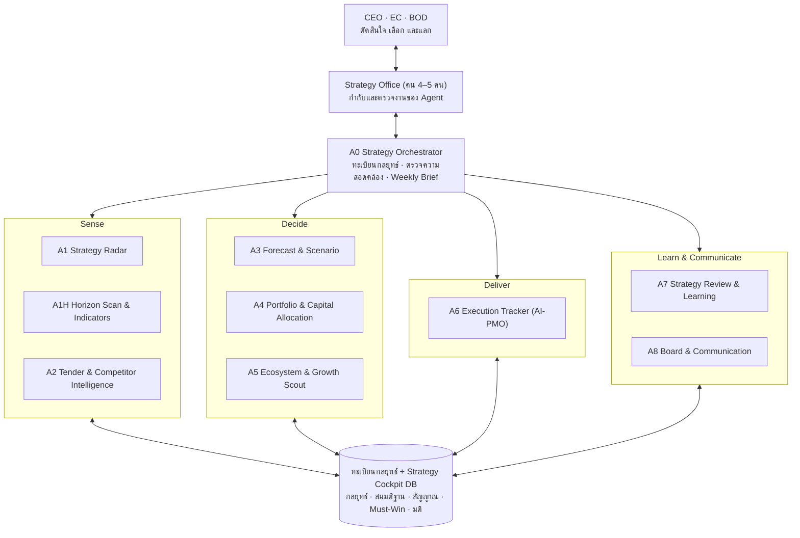

# Agentic Strategy Office: ต้องมี AI Agent กี่ตัว และทำหน้าที่อะไร

> ต่อจาก [01 — หน้าที่งานหลักของนักกลยุทธ์องค์กร](01-strategist-core-functions.md)
> เอกสารนี้เป็นแบบโครงสร้าง (design) ทั่วไป ไม่มีข้อมูลกลยุทธ์จริงขององค์กร

## 1. คำตอบสั้น

**10 Agents = 1 Orchestrator + 9 Specialist Agents** เปิดใช้ทีละระลอก · ตอนนี้ใช้งานแล้ว 9 ตัว (A0 · A1 · A1H · A2 · A3 · A5 · A6 · A7 · A8) ซึ่งรวมกันเป็น [Weekly Disruption Cycle](03-weekly-disruption-cycle.md) ทุกวันจันทร์ · A1H แยกงานมองไกล (Horizon Scan) ออกจาก A1 ทุกวันศุกร์

| เกณฑ์ที่ใช้กำหนดจำนวน | ผลลัพธ์ |
|---|---|
| ครอบคลุมหน้าที่งานนักกลยุทธ์ครบ 10 ด้าน (F1–F10) | ทุกหน้าที่มี Agent รับผิดชอบอย่างน้อย 1 ตัว |
| 1 Agent = เจ้าของที่เป็นคน 1 บทบาท + ข้อมูลเข้า 1 ชุด + ผลลัพธ์ที่ชัด | ไม่มี Agent ที่ไม่มีคนกำกับ |
| แยก Agent เมื่อ **จังหวะเวลา** หรือ **แหล่งข้อมูล** ต่างกัน | Radar (ข่าว รายวัน) แยกจาก Tender Intelligence (ประกาศจัดซื้อและคู่แข่ง รายสัปดาห์) |
| รวม Agent เมื่อใช้ข้อมูลและเจ้าของเดียวกัน | ตรวจตัวเลขขัดกันรวมไว้ใน Orchestrator |
| เปิดตามความพร้อมของข้อมูล | Agent ที่ต้องใช้ตัวเลขการเงินจริงรอระบบ ERP |

## 2. สถาปัตยกรรม

## 3. รายชื่อ Agent

| ID | Agent | ทำอะไร | หน้าที่ | ระยะของแผน | Input → Output | รอบ | เจ้าของ (คน) | อิสระ | ระลอก |
|---|---|---|---|---|---|---|---|---|---|
| A0 | **Strategy Orchestrator** ✅ | รวมผลทุก Agent ตรวจสถานะทีม Agent ตรวจข้อมูลค้าง เสนอปรับทะเบียน | F7, F10 | ทุกระยะ | รายงานของทุก Agent → **Weekly Disruption Brief** | จันทร์ 08:50 | Strategy Lead | L2 | 1 |
| A1 | **Strategy Radar** ✅ | สแกนข่าว/นโยบาย/ตลาด จุดเตือนของสมมติฐาน แหล่งทางการ และกลยุทธ์ที่ยังเป็นจุดบอด จับคู่กับกลยุทธ์และสมมติฐาน | F1, F2 | Externally-Oriented | ทะเบียน + ข่าว + แหล่งทางการ → Daily Brief, สัญญาณ, Assumption Watch, กฎระเบียบที่กำลังมา | ทุกวัน 07:45 | CI Analyst | L2 | 1 |
| A1H | **Horizon Scan & Indicators** ✅ | สัญญาณอ่อนระยะ 1–5 ปี (H2–H3) และตัวชี้วัดภายนอกรายสัปดาห์ที่มีแหล่งอ้างอิง ([05](05-radar-coverage-and-horizon-scan.md)) | F1 | Externally-Oriented | ธีม Horizon + ทะเบียน → สัญญาณ H2–H3, ตัวชี้วัด, ข้อเสนอให้ A3/A7 | ศุกร์ 06:40 | CI Analyst | L2 | 1 |
| A2 | **Tender & Competitor Intelligence** ✅ | ประกาศจัดซื้อ ผลผู้ชนะ ประกาศตลาดหลักทรัพย์ของคู่แข่ง win/loss และโจทย์ Pre-TOR | F2, F6 | Externally-Oriented | e-GP, เว็บลูกค้า, ประกาศบริษัทจดทะเบียน → Tender pipeline, Win/Loss brief | จันทร์ 05:55 | Business Generation | L2 | 1 |
| A3 | **Strategic Options & Scenario** ✅ | ออกแบบ Solution ให้เรื่องที่ Disrupt แผนเป็น Emerging Strategy พร้อมทางเลือก 2–3 ทาง (ต่อไป: Rolling forecast และฉากทัศน์ตัวเลขจาก ERP) | F3, F4, F5 | Forecast-Based | Scorecard ของ A7, ประมูล, พันธมิตร, Must-Win → Emerging Strategy, Decision Memo | จันทร์ 08:35 | Strategy Lead + CFO | L2 | 1 (ส่วน forecast: 3) |
| A4 | **Portfolio & Capital Allocation** | ติด Strategy ID ให้ Capex/Opex คำนวณ Strategic Fit เตือน say–do gap | F4 | Budgeting–Forecast | รายการ Capex/Opex + ทะเบียน → Capex fit report, Investment memo draft | ตามรอบงบ | CFO + Strategy Office | L2 | 2 |
| A5 | **Ecosystem & Growth Scout** ✅ | หาพันธมิตร/complementor คัดกรอง M&A/JV จับการเปลี่ยนแปลงของ Ecosystem | F5, F6 | Strategic Management | ข้อมูลบริษัท ข่าว BOI → Partner pipeline, Ecosystem themes | จันทร์ 06:25 | Investment / Holding | L2 | 1 |
| A6 | **Execution Tracker (AI-PMO)** ✅ | งาน Must-Win ที่ช้า ประเด็นข้อมูลที่ขวาง มติที่ไม่คืบ สัญญาณค้างเกิน SLA (ต่อไป: แผนงานรายคน, ERP) | F7, F8 | Budgeting / Execution | Must-Win, ประเด็นข้อมูล, มติ, สัญญาณ → Status report, Escalation list | จันทร์ 06:55 | COO + HR | L2 (L3 เมื่อส่งเตือนได้) | 1 |
| A7 | **Strategy Review & Learning** ✅ | Plan Disruption Scorecard รายสัปดาห์ + Non-Realized & Emerging (Mintzberg) รายไตรมาส | F9 | Strategic Management | Radar + Tender + Ecosystem + Execution → Scorecard, Assumption scorecard, Review pack | จันทร์ 08:20 | Strategy Office → CEO | L2 | 1 |
| A8 | **Board & Communication** ✅ | ร่าง Pack สไลด์ EC/BOD (ปรับถ้อยคำเท่านั้น ห้ามสร้าง/แก้ตัวเลข) | F10 | ทุกระยะ | สรุปผู้บริหาร + Emerging Strategy + Scorecard → Pack ก่อนประชุม | จันทร์ 09:10 (ประชุมใน 10 วัน) | Strategy Office + Corporate Comms | L2 | 1 |

### ความครอบคลุมหน้าที่งาน

| หน้าที่ | A0 | A1 | A1H | A2 | A3 | A4 | A5 | A6 | A7 | A8 |
|---|---|---|---|---|---|---|---|---|---|---|
| F1 มองอนาคต & สแกนสภาพแวดล้อม | | ● | ● | | | | | | | |
| F2 วิเคราะห์ข้อมูลเชิงกลยุทธ์ | | ● | | ● | | | | | | |
| F3 กำหนดกลยุทธ์ & ทางเลือก | | | | | ● | | | | | |
| F4 บริหารพอร์ต & จัดสรรทรัพยากร | | | | | ● | ● | | | | |
| F5 การเติบโต & โมเดลธุรกิจ | | | | | | | ● | | | |
| F6 Corporate Development & Ecosystem | | | | ● | | | ● | | | |
| F7 แปลงกลยุทธ์เป็นแผน & ถ่ายทอด | ● | | | | | | | ● | | |
| F8 บริหารโครงการ & Transformation | | | | | | | | ● | | |
| F9 ติดตามผล ทบทวน & ปรับ | | | | | | | | | ● | |
| F10 ที่ปรึกษาผู้บริหาร & สื่อสาร | ● | | | | | | | | | ● |

## 4. ระดับความอิสระ (Autonomy)

| ระดับ | ความหมาย | ตัวอย่าง |
|---|---|---|
| **L1** ช่วยเมื่อสั่ง | ทำงานเมื่อคนสั่ง คนตรวจทุกครั้ง | ทำฉากทัศน์ตามสมมติฐานที่ CFO กำหนด |
| **L2** ทำตามรอบ | ทำงานเองตามตารางเวลา คนตรวจก่อนนำไปใช้ | Radar รายสัปดาห์, ร่าง Board pack |
| **L3** ลงมือในกรอบ | ทำการกระทำที่ย้อนกลับได้เองภายในกติกา | ส่งเตือนเจ้าของงานที่เลยกำหนด |
| ~~L4~~ ตัดสินใจเอง | **ไม่ใช้กับงานกลยุทธ์** | — |

## 5. แผนเปิดใช้ 3 ระลอก

| ระลอก | ช่วงเวลา | Agent | เหตุผล |
|---|---|---|---|
| 1 | 0–3 เดือน | A0 ✅, A1 ✅, A2 ✅, A3 ✅ (ทางเลือก), A5 ✅, A6 ✅, A7 ✅, A8 ✅ | อ่านและร่างได้ทันที ความเสี่ยงต่ำ · A5–A7 เลื่อนขึ้นมาเพื่อตอบคำถามรายสัปดาห์ว่าอะไร Disrupt แผน |
| 2 | 3–9 เดือน | A4 · ขยาย A6 ไปถึงแผนงานรายคน | ผูกกลยุทธ์กับงบและการปฏิบัติ |
| 3 | หลังระบบ ERP พร้อม | A3 ส่วน Rolling forecast | ต้องใช้ตัวเลขการเงินจริง |

## 6. ทีมคนที่กำกับ Agent

| บทบาท | กำกับ Agent |
|---|---|
| Strategy Lead | A0, A7, A8 |
| CI / Strategy Analyst | A1, A2, A5 |
| Strategy PMO | A6 |
| Finance Partner | A3, A4 |
| CoE / Data–AI Engineer | ดูแลแพลตฟอร์ม, skill และการเชื่อมต่อข้อมูลของทุก Agent |

## 7. Strategy Cockpit: หน้าบ้านกลางของทุก Agent

ทุก Agent อ่าน/เขียนข้อมูลชุดเดียวกัน และผู้บริหารดูผ่านหน้าเดียว (Cockpit) แทนการเปิดหลายไฟล์

| Collection | เนื้อหา | Agent ที่เขียน | คนที่แก้ |
|---|---|---|---|
| `strategies` | ทะเบียนกลยุทธ์ + สถานะสมมติฐาน | A0, A1 | Strategy Office |
| `signals` | สัญญาณภายนอก (Impact × Likelihood, กลยุทธ์ × ด้าน) | A1, A2, A5 | สถานะ/บันทึก |
| `tenders` | ประกาศจัดซื้อ ผลผู้ชนะ ความเคลื่อนไหวคู่แข่ง | A2 | สถานะ (ไล่ตาม/ไม่เข้า/ชนะ/แพ้)/บันทึก |
| `partners` | Partner pipeline | A5 | ขั้นของพันธมิตร/บันทึก |
| `reports` | รายงานรายสัปดาห์ของ A0 · A2 · A3 · A5 · A6 · A7 (A0 มีส่วนสรุปผู้บริหาร) | A0, A2, A3, A5, A6, A7 | — |
| `emerging` | Emerging Strategy: Solution พร้อมทางเลือก (Decision Memo) | A3 | ขั้น / มติ / บันทึก |
| `boardpacks` | Pack สไลด์ก่อนประชุม | A8 | สถานะ / บันทึก |
| `battles` | Must-Win และงานถัดไป | A0, A6 | เจ้าของ Must-Win |
| `decisions` | บันทึกมติ EC/BOD/MM | — | Strategy Office |
| `issues` | ตัวเลข/นิยามที่ขัดกัน | A0 | Strategy Office |
| `events` | วันสำคัญ | A0, A1 | — |
| `agents` | ทีม Agent สถานะ และวันที่รันล่าสุด | ทุก Agent (เฉพาะของตัวเอง) | — |
| `meta/cockpit` | วันที่รัน Radar และ Weekly Brief ล่าสุด, รุ่นทะเบียน | A1, A0 | — |

> Cockpit ที่มีข้อมูลจริงเป็น artifact ส่วนตัว (private) — ไม่อยู่ใน repo นี้

## 8. หลักกำกับ (Guardrails)

1. **AI เสนอ คนตัดสินใจ** — การเลือกและการแลกเป็นของผู้บริหาร
2. **ห้าม Agent สร้างหรือแก้ตัวเลขทางการเงิน** — ดึงจากระบบต้นทางเท่านั้น
3. **ทุกข้อสรุปมีแหล่งอ้างอิงและวันที่** — สัญญาณระดับวิกฤตต้องตรวจต้นฉบับ
4. **แยกข้อมูลลับออกจากโค้ด** — Skill อยู่ใน repo ได้ ข้อมูลจริงอยู่ในพื้นที่ private
5. **Audit log** — เก็บว่าใช้ข้อมูลใด เสนออะไร ใครอนุมัติ (รองรับกฎหมาย AI ที่กำลังจะมา)
