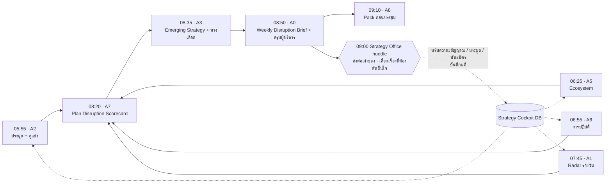

# Weekly Disruption Cycle: ทุกวันจันทร์ อะไรกำลัง Disrupt แผน

> ต่อจาก [02 — Agentic Strategy Office](02-agentic-strategy-office.md)
> เอกสารนี้เป็นแบบโครงสร้าง (design) ทั่วไป ไม่มีข้อมูลกลยุทธ์จริงขององค์กร

## 1. คำถามเดียวของรอบสัปดาห์

ทุกวันจันทร์ ผู้บริหารต้องได้คำตอบว่า **"สัปดาห์นี้มีอะไรที่ทำให้แผนเดินไม่ได้ตามที่ตั้งใจ และต้องตัดสินใจอะไร"**

สิ่งที่ Disrupt แผนมาได้ 6 ทาง จึงให้ Agent แยกกันเก็บแล้วรวมเป็นฉบับเดียว

| ทาง | ตัวอย่าง | Agent ที่จับ |
|---|---|---|
| ภายนอก (`external`) | นโยบาย ราคา เทคโนโลยี เศรษฐกิจ | A1 Radar (รายวัน) |
| คู่แข่ง / ประมูล (`competitor`) | คู่แข่งได้สัญญา ประกาศจัดซื้อใหม่ ผลผู้ชนะ | A2 Tender & Competitor |
| Ecosystem (`ecosystem`) | พันธมิตรใหม่ของคู่แข่ง ผู้เล่นต่างชาติเข้าตลาด แพลตฟอร์มใหม่ | A5 Ecosystem Scout |
| การปฏิบัติ (`execution`) | งาน Must-Win เลยกำหนด มติที่ไม่คืบ | A6 Execution Tracker |
| สมมติฐาน (`assumption`) | สมมติฐานที่กลยุทธ์พึ่งพาเริ่มไม่จริง | A7 Strategy Review |
| ข้อมูล (`data`) | ตัวเลขขัดกันที่ขวางการตัดสินใจ | A6 + A0 |

## 2. ลำดับการทำงาน (เวลาไทย)

- ทุก Agent เป็น Claude Code Routine ที่เปิด session ใหม่ทุกครั้ง อ่านและเขียนฐานข้อมูลของ Strategy Cockpit (ข้อมูลชุดเดียว)
- ลำดับเวลาจัดให้ A7 เห็นผลของ A2 · A5 · A6 · A1 ก่อนประเมิน และ A0 เห็นทุกอย่างก่อนสรุป
- ถ้า Agent ตัวใดไม่ได้รัน A0 จะรายงานใน "สถานะ Agent" และสรุปจากข้อมูลที่มี

## 3. หน้าที่ของแต่ละ Agent ในรอบสัปดาห์

| Agent | อ่าน | เขียน | ผลลัพธ์ที่ผู้บริหารเห็น |
|---|---|---|---|
| A2 Tender & Competitor | ทะเบียนกลยุทธ์ (ลูกค้า คู่แข่ง เทคโนโลยี) + WebSearch | `tenders`, `signals` (รหัส `-T`), `reports/A2-<วันที่>` | Tender pipeline · ความเคลื่อนไหวคู่แข่ง · Win/Loss |
| A5 Ecosystem Scout | ทะเบียนกลยุทธ์ + WebSearch | `partners`, `signals` (รหัส `-E`), `reports/A5-<วันที่>` | Partner pipeline · Ecosystem themes |
| A6 Execution Tracker | `battles`, `issues`, `events`, `decisions`, `signals` | `reports/A6-<วันที่>` | งานเลยกำหนด · ใกล้ครบกำหนด · สัญญาณค้าง · Escalation |
| A7 Strategy Review | ทุกอย่างข้างบน + สมมติฐาน | `reports/A7-<วันที่>`, สถานะสมมติฐาน | Plan Disruption Scorecard · Emerging · Non-Realized |
| A3 Strategic Options | รายงาน A7 + ทะเบียน + พันธมิตร + ประมูล | `emerging`, `reports/A3-<วันที่>` | Solution (Emerging Strategy) + Decision Memo — ดู [04](04-emerging-strategy-and-executive-briefing.md) |
| A0 Orchestrator | รายงานทุกตัว + Daily Brief ของ A1 | `reports/A0-<วันที่>` | **Weekly Disruption Brief** + สรุปผู้บริหาร 1 หน้า |
| A8 Board & Communication | สรุปผู้บริหาร + Emerging Strategy | `boardpacks` | Pack สไลด์ก่อนประชุม EC / BOD |

## 4. มาตรวัดที่ใช้ร่วมกัน

### 4.1 ความรุนแรงของสิ่งที่ Disrupt แผน

| ระดับ | ความหมาย |
|---|---|
| **วิกฤต** (`critical`) | อาจทำให้เป้าหมายของกลยุทธ์หรือ Must-Win ไม่สำเร็จภายใน 3–12 เดือน หรือต้องให้ผู้บริหารตัดสินใจภายใน 2 สัปดาห์ |
| **สูง** (`high`) | เจ้าของกลยุทธ์ต้องปรับแผนหรือโครงการภายในไตรมาสนี้ |
| **กลาง** (`medium`) | เฝ้าดูต่อ |

ทุกเรื่องต้องมี: เกิดอะไร → กระทบเป้าหมาย/สมมติฐานใด → ผลต่อแผน · ข้อเสนอ · เจ้าของ · วันที่ควรทำ · รหัสหลักฐาน

### 4.2 สถานะแผนรายกลยุทธ์ (A7)

| สถานะ | เกณฑ์ |
|---|---|
| ถูก Disrupt | มีหลักฐานว่าเป้าหมาย สมมติฐานหลัก หรือ Must-Win จะไม่สำเร็จถ้าไม่เปลี่ยนทิศ |
| มีความเสี่ยง | ภัยระดับสูง สมมติฐานเริ่มสั่นคลอน หรืองาน Must-Win ที่ผูกอยู่เลยกำหนด |
| จับตา | สัญญาณระดับเฝ้าระวังหรือผสม เริ่มมีเค้า |
| ตามแผน | ไม่มีหลักฐานเชิงลบที่มีนัยสำคัญ |
| ยังไม่มีข้อมูล | ไม่มีสัญญาณใน 30 วัน — เป็น blind spot ของ Radar ต้องปรับ keyword |

A7 เปลี่ยนสถานะเมื่อมีหลักฐานใหม่เท่านั้น และระบุสถานะเดิมทุกครั้ง เพื่อให้เห็นแนวโน้มรายสัปดาห์

### 4.3 กำหนดเวลาตอบสนองสัญญาณ (SLA)

| ระดับสัญญาณ | ต้องมีคำตอบภายใน | ถ้าเกิน |
|---|---|---|
| วิกฤต | 7 วัน | A6 ยกระดับใน Weekly Brief |
| สูง | 30 วัน | A6 ยกระดับใน Weekly Brief |

"คำตอบ" คือการเปลี่ยนสถานะสัญญาณใน Cockpit เป็น กำลังติดตาม / ดำเนินการแล้ว / ปิดแล้ว หรือบันทึกมติ

## 5. โครงข้อมูลใน Strategy Cockpit

| Collection | รหัสเอกสาร | ฟิลด์หลัก | ฟิลด์ที่คนเป็นเจ้าของ |
|---|---|---|---|
| `signals` | `SIG-YYYYMMDD-NN` (A1) · `SIG-YYYYMMDD-TNN` (A2) · `SIG-YYYYMMDD-ENN` (A5) | headline, date, run, agent, impact × likelihood, level, impacts[กลยุทธ์ × ด้าน × ทิศทาง], sources | `status`, `note` |
| `tenders` | `TND-YYYYMMDD-NN` | kind (ประกาศ/แผนจัดซื้อ/ผลผู้ชนะ/คู่แข่ง), buyer, budget, deadline, winner, strategies, fit 1–5, why, nowhat, sources | `status` (ใหม่/ไล่ตาม/เฝ้าดู/ไม่เข้า/ชนะ/แพ้), `note` |
| `partners` | `PTN-<ชื่อ>` | name, type, country, what, why, risk, strategies, fit 1–5, firstSeen, lastSeen, sources | `stage` (พบใหม่/คัดกรอง/ติดต่อแล้ว/เจรจา/พักไว้), `note` |
| `reports` | `<Agent>-YYYY-MM-DD` | agent, date, week, headline, summary, disruptions[] + ฟิลด์เฉพาะของแต่ละ Agent | — |

ฟิลด์เฉพาะใน `reports`

- **A2:** counts, newTenders, hotDeadlines, competitorMoves, winLoss
- **A5:** themes, newPartners, updatedPartners, proposals
- **A6:** battles[งานเลยกำหนด/ใกล้ครบ], sla, issues, decisions, escalations
- **A7:** scorecard[กลยุทธ์ × สถานะ × เหตุผล × หลักฐาน], battles, assumptionChanges, emergent, nonRealized, questions, quarterly
- **A0:** decisionsNeeded, upcoming, agentHealth, dataIssues, registerProposals, kpis

## 6. วาระ Strategy Office huddle วันจันทร์ (30 นาที)

1. **5 นาที** — อ่านหัวข้อและสรุปของ Weekly Disruption Brief
2. **15 นาที** — ไล่เรื่องระดับวิกฤตและสูง: ยืนยันเจ้าของและวันที่ หรือปัดตก (บันทึกเหตุผล)
3. **5 นาที** — เลือกเรื่องที่ต้องเข้า EC/BOD/MM และบันทึกใน Decision Log
4. **5 นาที** — ปรับสถานะใน Cockpit: สัญญาณ ประมูล (ไล่ตาม/ไม่เข้า) พันธมิตร (คัดกรอง/พักไว้) — ข้อมูลนี้ป้อนกลับให้ Agent สัปดาห์ถัดไป

## 7. หลักกำกับเพิ่มเติมของรอบสัปดาห์

- Agent **ไม่แก้** ข้อมูลที่คนเป็นเจ้าของ: สถานะ/บันทึกของสัญญาณ ประมูล พันธมิตร, Must-Win, มติ, ประเด็นข้อมูล, วันสำคัญ
- A7 ปรับได้เฉพาะ **สถานะสมมติฐาน** พร้อมหลักฐาน · A0 เสนอการปรับทะเบียนกลยุทธ์ได้ แต่ **ไม่แก้เอง**
- A5 **ไม่ติดต่อบริษัทใด** — รายชื่อพันธมิตรเป็น lead ให้ทีม BD/Holding คัดกรอง
- ทุกเรื่องต้องย้อนกลับไปหารหัสหลักฐานได้ (SIG / TND / PTN / Must-Win / ประเด็นข้อมูล)
