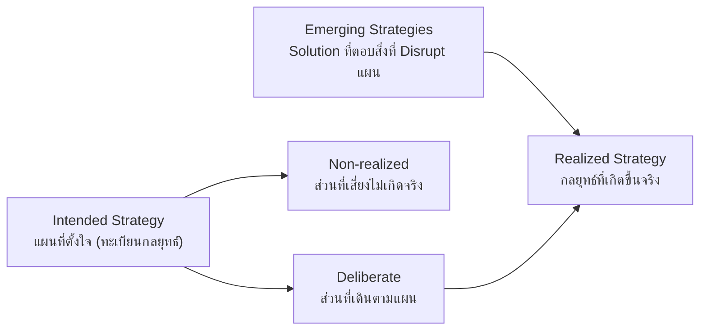
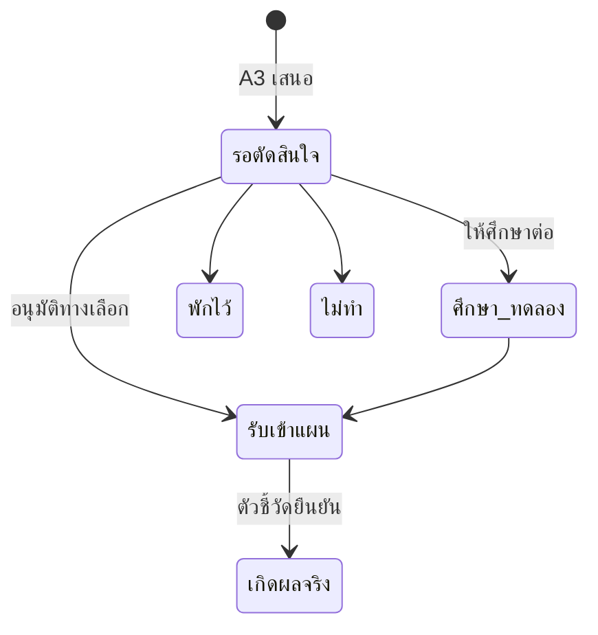

# จาก Disruption สู่ Emerging Strategy และการนำเสนอผู้บริหาร

> ต่อจาก [03 — Weekly Disruption Cycle](03-weekly-disruption-cycle.md)
> เอกสารนี้เป็นแบบโครงสร้าง (design) ทั่วไป ไม่มีข้อมูลกลยุทธ์จริงขององค์กร

## 1. กรอบคิด: Mintzberg

| ส่วนของภาพ | ระบบวัดจากอะไร | Agent |
|---|---|---|
| Intended | ทะเบียนกลยุทธ์ | — |
| Deliberate | กลยุทธ์ที่ A7 ให้สถานะ "ตามแผน" หรือ "จับตา" | A7 |
| Non-realized | กลยุทธ์ที่ A7 ให้สถานะ "ถูก Disrupt" หรือ "มีความเสี่ยง" | A7 |
| Emerging | Solution ที่ A3 ออกแบบให้แต่ละเรื่องที่ Disrupt แผน และโอกาสนอกแผน | A3 |
| Realized | งาน Must-Win ที่เสร็จ + Emerging Strategy ที่ผู้บริหารอนุมัติรับเข้าแผน | A6 + คน |

แต่ละเรื่องที่ Disrupt แผนต้องได้ **คำตอบ** ไม่ใช่แค่การรายงาน: A3 ทำหน้าที่ออกแบบคำตอบ และผู้บริหารเป็นผู้เลือก

## 2. A3 ออกแบบ Solution อย่างไร

ทุกวันจันทร์ 08:35 น. หลัง A7 ประเมิน A3 เลือกเรื่องระดับวิกฤตและสูง (รวมเรื่องที่มีต้นเหตุเดียวกัน) และโอกาสนอกแผน ไม่เกิน 6 เรื่องต่อสัปดาห์ แล้วเขียนข้อเสนอแบบ **SCQA**

| ส่วน | เนื้อหา |
|---|---|
| **S** สถานการณ์ | แผนเดิมตั้งใจอะไร เพราะอะไร |
| **C** สิ่งที่เปลี่ยน | เรื่องที่ Disrupt แผน พร้อมหลักฐาน |
| **Q** คำถาม | สิ่งที่ผู้บริหารต้องตัดสินใจ |
| ทางเลือก 2–3 ทาง | ต้อง **ต่างกันเชิงกลยุทธ์จริง** (เช่น สู้ตรง / เปลี่ยนวิธีชนะ / จับมือพันธมิตร) ไม่ใช่ขนาดต่างกันของสิ่งเดียวกัน · ข้อดี ข้อเสีย แรง เวลา และผลต่อ Platform / Ecosystem |
| ข้อแนะนำ | ทางเลือกที่แนะนำและเหตุผล |
| ถ้าไม่ตัดสินใจ | จะเสียอะไร ภายในวันไหน |
| 90 วันแรก | 3–5 งาน พร้อมผู้รับผิดชอบและวันที่ |
| ตัวชี้วัดล่วงหน้า | 2–3 ตัว ที่บอกได้เร็วว่าได้ผลหรือไม่ |

ผลต่อแผนที่ตั้งใจ (`planEffect`): ป้องกันฐานเดิม · ปรับวิธีชนะ · เร่งให้เร็วขึ้น · จับมือพันธมิตร · ธุรกิจ/โครงการใหม่ · หยุด/ลดขนาด

**ห้ามสร้างตัวเลขเงิน เป้าหมาย หรือขนาดตลาดเอง** — ใช้ตัวเลขได้เฉพาะที่มีในหลักฐานและต้องอ้างรหัส

### วงจรชีวิตของ Emerging Strategy

- **คนเป็นเจ้าของขั้น** (stage) และมติ — A3 แก้ได้เฉพาะเนื้อหาของข้อเสนอที่ยังรอตัดสินใจ และเพิ่มบันทึกความคืบหน้าให้ข้อเสนอที่ผ่านขั้นแล้ว
- การบันทึกมติใน Decision Memo สร้างรายการใน Decision Log และย้ายขั้นของข้อเสนอให้อัตโนมัติ
- ข้อเสนอที่ "รับเข้าแผน" คือสัญญาณให้ Strategy Office ปรับทะเบียนกลยุทธ์ (Intended) รอบถัดไป

## 3. หลักการนำเสนอผู้บริหาร

| หลัก | วิธีทำในระบบ |
|---|---|
| **คำตอบก่อน** (Pyramid Principle / BLUF) | ประโยคแรกของสรุปผู้บริหารบอกสถานะแผนและสิ่งที่ต้องทำ |
| **ไม่เกิน 3** | 3 เรื่องที่ Disrupt แผน + 3 เรื่องที่ขอมติ รายละเอียดอยู่ในมุมมองทีมกลยุทธ์ |
| **บอกสิ่งที่เปลี่ยน** | อะไรแย่ลง อะไรดีขึ้น Solution ใหม่กี่เรื่อง รับเข้าแผนกี่เรื่อง เทียบกับสัปดาห์ก่อน |
| **ขอมติเป็นทางเลือก** | แต่ละเรื่องมีทางเลือก A / B / C ข้อแนะนำ และผลของการไม่ตัดสินใจ |
| **ไม่ใช้รหัส** | ใช้ชื่อสั้นของกลยุทธ์และ Must-Win ที่ผู้บริหารคุ้น รหัสเก็บไว้ในมุมมองทีมกลยุทธ์ |

### การนำเสนอ 3 ระดับ

| ระดับ | ผู้อ่าน | รูปแบบ | ใครทำ |
|---|---|---|---|
| 1. สรุปผู้บริหาร 1 หน้า | CEO, EC — ทุกวันจันทร์ | อ่านจบใน 2 นาทีบนมือถือ · มีข้อความพร้อมส่งต่อทาง LINE / Teams / อีเมล | A0 |
| 2. Decision Memo | EC — ก่อนประชุม | 1 หน้าต่อ 1 เรื่องแบบ SCQA · บันทึกมติได้ในหน้าเดียวกัน | A3 |
| 3. Pack สำหรับ EC / BOD | EC, BOD — ก่อนประชุม 10 วัน | สไลด์ 6–9 หน้า หัวข้อเป็นประโยคข้อสรุป · กราฟและทางเลือกดึงข้อมูลจริงตอนนำเสนอ | A8 (ถ้อยคำเท่านั้น) |

### มุมมองตามบทบาท

- **ทั้งองค์กร (CEO):** ทุกเรื่อง
- **การปฏิบัติ (COO):** เรื่องด้านการปฏิบัติ ข้อมูล และคู่แข่ง
- **การเงินและการลงทุน (CFO):** เรื่องด้านการลงทุน ต้นทุน การเงิน และราคา
- **หน่วยงาน:** เฉพาะกลยุทธ์ที่หน่วยงานนั้นเป็นเจ้าของ

A0 ใส่ป้ายบทบาทให้แต่ละเรื่อง Cockpit กรองตามป้ายนั้น

### โหมดนำเสนอ

- สไลด์ 16:9 เลื่อนด้วยปุ่มลูกศร มีบันทึกผู้พูด และเปิดเต็มจอได้
- สไลด์ขอมติบันทึกมติได้ระหว่างประชุม โดยกดยืนยันก่อนบันทึกทุกครั้ง
- ชุดสไลด์รายสัปดาห์สร้างจากสรุปผู้บริหารอัตโนมัติ ส่วน Pack ก่อนประชุมมาจาก A8

## 4. ตารางเวลาวันจันทร์ (ฉบับปรับปรุง)

| เวลา | Agent | ผลลัพธ์ |
|---|---|---|
| 05:55 | A2 | ประมูลและคู่แข่ง |
| 06:25 | A5 | Ecosystem |
| 06:55 | A6 | การปฏิบัติ |
| 07:45 | A1 | Radar รายวัน |
| 08:20 | A7 | Plan Disruption Scorecard |
| 08:35 | **A3** | **Emerging Strategy พร้อมทางเลือก** |
| 08:50 | A0 | Weekly Disruption Brief + **สรุปผู้บริหาร** |
| 09:10 | **A8** | **Pack สำหรับประชุมที่อยู่ภายใน 10 วัน** |

## 5. โครงข้อมูลเพิ่มเติม

| Collection | รหัสเอกสาร | ฟิลด์หลัก | ฟิลด์ที่คนเป็นเจ้าของ |
|---|---|---|---|
| `emerging` | `EMG-YYYYMMDD-NN` | kind, title, oneLiner, planEffect, respondsTo, situation, complication, question, options[], recommendation, costOfInaction, firstMoves[], signposts[], risks, owner, strategies, battles, refs, ask, updates[] | `stage`, `decision`, `note` |
| `boardpacks` | `BP-<รหัสวันสำคัญ>` | meeting, forum, date, basedOn, slides[type, title, bullets, items, emg, notes], refs | `status` (ร่าง/พร้อมนำเสนอ), `note` |
| `reports/A0-*` | — | เพิ่ม `exec` {bluf, overall, top[≤3], asks[≤3], changes, message} | — |
| `decisions` | อัตโนมัติ | เพิ่ม emg, option, forum เมื่อบันทึกจาก Decision Memo | ทั้งหมด |
| `strategies`, `battles` | — | เพิ่ม `short` (ชื่อสั้นสำหรับผู้บริหาร) | ทั้งหมด |

## 6. หลักกำกับ

- AI ออกแบบทางเลือกและร่างเอกสาร **คนเลือก** — ไม่มี Agent ใดเปลี่ยนขั้นของ Emerging Strategy หรือบันทึกมติเอง
- A8 **ปรับถ้อยคำเท่านั้น** ไม่สร้างหรือแก้ตัวเลข
- ทุกข้อเสนอต้องย้อนไปหาหลักฐานได้ (รหัสสัญญาณ ประมูล พันธมิตร Must-Win ประเด็นข้อมูล)
- ข้อความส่งต่อผู้บริหารมีลิงก์ไป Cockpit ซึ่งเปิดได้เฉพาะคนที่ได้รับสิทธิ์
