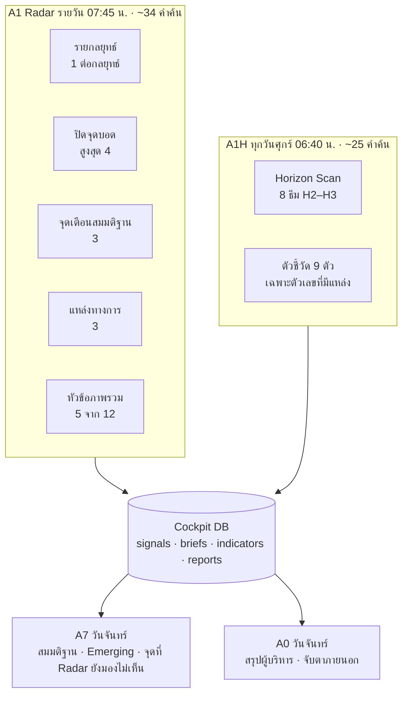

# Radar ที่มองครบมุม: จุดเตือน แหล่งทางการ จุดบอด และ Horizon Scan

> ต่อจาก [04 — Emerging Strategy และการนำเสนอผู้บริหาร](04-emerging-strategy-and-executive-briefing.md)
> เอกสารนี้เป็นแบบโครงสร้าง (design) ทั่วไป ไม่มีข้อมูลกลยุทธ์จริงขององค์กร

## 1. ปัญหาของ Radar รุ่นแรก

Radar ที่ค้นจาก keyword ของกลยุทธ์อย่างเดียวมีแนวโน้มเอียง 4 ทาง

| อาการ | ผลต่อการบริหารกลยุทธ์ |
|---|---|
| สัญญาณกระจุกที่นโยบายและอุตสาหกรรม (P, I) ด้านสังคม เทคโนโลยี สิ่งแวดล้อมแทบไม่มี | ไม่เห็นความเสี่ยงด้านคน ESG และเทคโนโลยีจนสายเกินไป |
| ด้านที่กระทบไม่ครบ: ลูกค้า (D2) ต้นทุน (D6) การเงิน (D7) คน (D8) ESG (D10) บาง | สมมติฐานเรื่องอุปสงค์ ต้นทุน และคนไม่ถูกทดสอบ |
| เกือบทั้งหมดเป็นระยะสั้น (H0–H1) | มองไม่เห็นสิ่งที่จะเปลี่ยนเกมใน 3–5 ปี |
| บางกลยุทธ์ไม่มีสัญญาณเลย (จุดบอด) | A7 ประเมินได้แค่ "ยังไม่มีข้อมูล" |

## 2. สิ่งที่เพิ่ม

### 2.1 ห้าเรื่องที่ทำก่อน

| เรื่อง | ทำอย่างไร | ปิดช่องว่าง |
|---|---|---|
| **ติดตามจุดเตือนของสมมติฐาน** | วันละ 3 สมมติฐาน เรียงจากที่สั่นคลอนที่สุด สร้างคำค้นจาก `signposts` ในทะเบียน และบันทึกทุกจุดที่ตรวจแม้ไม่พบอะไร | สมมติฐานถูกทดสอบสม่ำเสมอ ไม่ต้องรอข่าวมาหาเอง |
| **อุปสงค์และงบลงทุนของลูกค้า** (D2) | หัวข้อ `customer_demand`: การอนุมัติลงทุน การขยายนิคม การย้ายฐานผลิต งบลงทุนรัฐวิสาหกิจ การจัดหาไฟของ Data Center | รู้ล่วงหน้าว่าลูกค้าจะลงทุนหรือชะลอ |
| **ต้นทุนวัตถุดิบและซัพพลายเชน** (D6) | หัวข้อ `input_costs` + ตัวชี้วัดราคาโลหะ ค่าเงิน ค่าขนส่ง เซลล์แบตเตอรี่ | สมมติฐานด้านต้นทุนและราคามีตัวเลขรองรับ |
| **กฎระเบียบตั้งแต่ขั้นร่าง** (L) | วันละ 3 แหล่งทางการ ด้วย WebSearch แบบจำกัดโดเมน: ราชกิจจานุเบกษา ผู้กำกับดูแลพลังงาน การไฟฟ้า ระบบรับฟังความคิดเห็นร่างกฎหมาย มาตรฐานผลิตภัณฑ์ การลงทุนและตลาดทุน | เห็นกฎใหม่ตอนยังแสดงความเห็นได้ ไม่ใช่ตอนบังคับใช้แล้ว |
| **คนและแรงงาน** (D8) | หัวข้อ `talent`: ค่าแรง ขาดแคลนวิศวกร สิทธิประโยชน์ดึงคนเก่ง เงินเดือนสาย IT/AI หลักสูตร AI | แผนคนและ AI Organization มีสัญญาณภายนอกประกอบ |

### 2.2 ปิดจุดบอด

- กลยุทธ์ที่ไม่มีสัญญาณใน 30 วันได้คำค้นเพิ่มวันละ 1 คำค้น (สูงสุด 4 กลยุทธ์ต่อวัน) โดยอัตโนมัติ
- เพิ่มคำค้นในทะเบียนของกลยุทธ์ที่เงียบ โดยมองจาก 4 มุม: **ลูกค้าปลายทาง · วัตถุดิบต้นน้ำ · กฎระเบียบเฉพาะ · ผู้เล่นใหม่** (ตัวอย่างประเภทคำค้น: ช่องทางขายส่งออนไลน์ · นิคมใหม่และสัญญาบริการพลังงาน · ราคาวัตถุดิบชีวมวลและการส่งออก · มาตรฐานภาชนะสัมผัสอาหาร · ภัยไซเบอร์ระบบควบคุมโรงงาน · กฎหมายแพลตฟอร์มและ Sandbox · แผนไฟฟ้าและแหล่งเงินกู้ของประเทศเพื่อนบ้าน)
- A1 รายงาน `stillBlind` ทุกวัน · A7 สรุป `radarGaps` ทุกวันจันทร์ ให้ Strategy Office ปรับคำค้น

### 2.3 มุมเชิงลึก

| มุม | ที่อยู่ในระบบ |
|---|---|
| Horizon Scan H2–H3 | A1H ทุกวันศุกร์ — 8 ธีม: เทคโนโลยีกริดและการกักเก็บพลังงาน · AI / Agentic / Physical AI · Bioeconomy และการดูดกลับคาร์บอน · Data Center และพลังงานสำหรับ AI · โมเดลธุรกิจ Platform และ Data Space · สังคมและแรงงาน · ภูมิรัฐศาสตร์ระยะยาว · สภาพภูมิอากาศระยะยาว |
| ภูมิรัฐศาสตร์และการค้า | หัวข้อ `geopolitics_trade` (ภาษีนำเข้า สินค้าทุ่มตลาด FTA การค้าชายแดน) |
| ความเสี่ยงสภาพภูมิอากาศเชิงกายภาพ | หัวข้อ `climate_physical` (น้ำท่วมนิคม คลื่นความร้อนกับความต้องการไฟฟ้า ภัยแล้งกับวัตถุดิบเกษตร) |
| ตลาดทุนและแหล่งเงิน (D7) | หัวข้อ `capital_markets` + ตัวชี้วัดดอกเบี้ยนโยบาย |
| ESG ที่ลูกค้าและผู้ประเมินกำหนด (D10) | หัวข้อ `esg_requirements` (เกณฑ์ประเมิน ESG Scope 3 ของลูกค้า มาตรฐานรายงาน) + ตัวชี้วัดราคาคาร์บอน |
| เสียงสาธารณะ | หัวข้อ `public_voice` (การคัดค้านโครงการ ค่าไฟ ความเห็นต่อพลังงานหมุนเวียน) |

## 3. ตัวชี้วัดภายนอกรายสัปดาห์

| หลักการ | รายละเอียด |
|---|---|
| ตัวเลขต้องมีที่มา | บันทึกเฉพาะค่าที่ผลค้นหาระบุ **ค่า · หน่วย · วันที่ของค่า · แหล่งพร้อม URL** |
| ไม่แปลงเอง | ห้ามแปลงหน่วยหรือสกุลเงิน ห้ามประมาณ ห้ามเติมช่องว่าง |
| ความสด | ค่าตลาดต้องไม่เก่ากว่า `freshness_days` · ค่าทางการ (ดอกเบี้ย ค่าไฟ กำลังผลิตที่อนุมัติ) ใช้ค่าล่าสุดได้ |
| ไม่พบก็ไม่บันทึก | รายงานบอกว่าไม่พบตัวไหนและเพราะอะไร |
| ใช้เป็นหลักฐาน | A7 อ้างตัวชี้วัดเป็น `IND-<key>` เมื่อประเมินสมมติฐานด้านต้นทุนและการเงิน · A0 เลือกการเปลี่ยนแปลงที่สำคัญ 3–5 ตัวไปไว้ใน "จับตาภายนอก" |

ตัวชี้วัดเริ่มต้น: ราคาทองแดง · ค่าเงินบาท · ดอกเบี้ยนโยบาย · ค่า Ft · ราคาคาร์บอน EU ETS · ราคาคาร์บอนเครดิตในประเทศ · กำลังไฟ Data Center ที่ประกาศ · ราคาเซลล์แบตเตอรี่ LFP · ราคาเยื่อไม้ใยสั้น

## 4. โครงข้อมูลเพิ่มเติม

| Collection / ฟิลด์ | รายละเอียด |
|---|---|
| `signals.angle` | มุมที่พบ: `strategy` · `blindspot` · `signpost` · `primary` · `horizon` · `indicator` · หรือรหัสหัวข้อ |
| `signals.deadline` | กำหนดรับฟังความคิดเห็น / วันมีผล (สัญญาณจากแหล่งทางการ) |
| `signals` ของ A1H | รหัส `SIG-YYYYMMDD-HNN` · เพิ่ม `theme`, `maturity`, `watchFor` |
| `briefs` | เพิ่ม `signpostsChecked[]`, `regulatoryPipeline[]`, `coverage{drivers, angles, blindSpotsQueried, stillBlind}` |
| `indicators/<key>` | `name, unit, latest{value, asOf, source, note}, prev, change, changePct, series[≤26]` |
| `reports/A1H-*` | `themes[]`, `indicators[]`, `notFound[]`, `implications[]`, `logOnly[]` |
| `reports/A7-*` | เพิ่ม `radarGaps[]` |
| `reports/A0-*` | เพิ่ม `outlook{indicators, weakSignals, regulatory}` และ `exec.watch[≤3]` |

## 5. สิ่งที่ผู้ดูแลระบบช่วยได้

- **เปิด network allowlist ให้โดเมนทางการ** (เช่น ราชกิจจานุเบกษา ผู้กำกับดูแลพลังงาน ตลาดหลักทรัพย์ ธนาคารกลาง หน่วยงานส่งเสริมการลงทุน ระบบจัดซื้อจัดจ้างภาครัฐ) ใน environment ของ Routine — Agent จะเปิดอ่านต้นฉบับได้ (WebFetch) แทนการอาศัยผลค้นหาอย่างเดียว ความแม่นของวันที่และตัวเลขจะดีขึ้น
- ทบทวนคำค้นของกลยุทธ์ที่ A7 ระบุใน "จุดที่ Radar ยังมองไม่เห็น" ทุกเดือน
