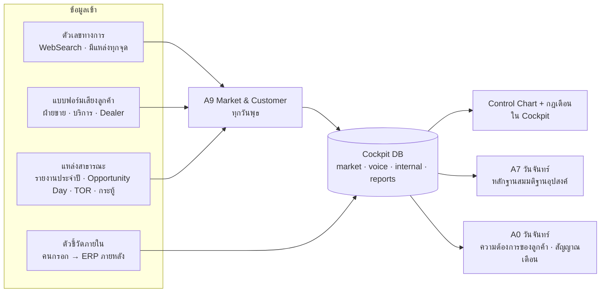
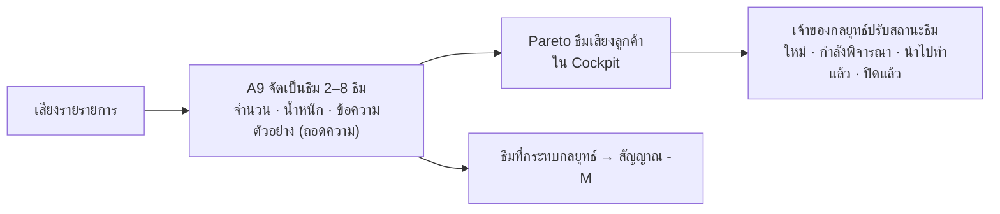

# Market & Customer Intelligence และ 7QC Tools พร้อมสัญญาณเตือน

> ต่อจาก [05 — Radar ที่มองครบมุม](05-radar-coverage-and-horizon-scan.md)
> เอกสารนี้เป็นแบบโครงสร้าง (design) ทั่วไป ไม่มีข้อมูลกลยุทธ์จริงขององค์กร

## 1. ทำไมต้องมีชั้นข้อมูลลูกค้าแยกจากข่าว

Radar (A1 · A1H · A2 · A5) บอกว่า **โลกภายนอกเกิดอะไรขึ้น** แต่ยังตอบไม่ได้ว่า **ลูกค้าจะซื้อมากขึ้นหรือน้อยลง และลูกค้ากำลังพูดอะไร** สมมติฐานด้านอุปสงค์ (D1) และลูกค้า (D2) จึงถูกทดสอบด้วยข่าวเพียงอย่างเดียว ซึ่งไม่พอ

ระบบจึงเพิ่มข้อมูล 3 ชั้น

| ชั้น | คืออะไร | ใครเก็บ | ตัวอย่าง |
|---|---|---|---|
| **1. ตัวเลขอุปสงค์ (Demand Pulse)** | ตัวเลขทางการจากหน่วยงานรัฐ/สมาคม ที่บอกว่ากลุ่มลูกค้าลงทุนหรือใช้จ่ายมากขึ้นหรือไม่ | A9 (Agent) ทุกวันพุธ | งบลงทุนของการไฟฟ้า · ยอดใช้ไฟ · ดัชนีผลผลิตอุตสาหกรรม · ยอดขายที่ดินนิคม · ใบอนุญาตก่อสร้าง · ยอดจดทะเบียนรถไฟฟ้า · มูลค่าส่งออก/นำเข้ารายพิกัด |
| **2. เสียงลูกค้า (Voice of Customer)** | สิ่งที่ลูกค้าพูดกับฝ่ายขาย ฝ่ายบริการ ตัวแทนจำหน่าย และที่พูดในที่สาธารณะ | คนหน้างาน (แบบฟอร์ม) + A9 (แหล่งสาธารณะ) | ความต้องการใหม่ · ปัญหา · ราคาคู่แข่ง · แผนลงทุนของลูกค้า · การเปลี่ยนสเปก |
| **3. ตัวชี้วัดภายใน** | ตัวเลขการขายของเราเอง | คนกรอกใน Cockpit · ภายหลังดึงจาก ERP | ยอดสั่งซื้อ (PO Received) · ยอดขายรายกลุ่มลูกค้า · มูลค่า Pipeline · อัตราชนะประมูล |

ทั้ง 3 ชั้นใช้ **กลุ่มลูกค้า (segment)** ชุดเดียวกัน และผูกกับสมมติฐานในทะเบียนกลยุทธ์ เพื่อให้ A7 ใช้เป็นหลักฐานได้โดยตรง

## 2. A9 Market & Customer Intelligence

รอบทำงาน **ทุกวันพุธ** — กลางสัปดาห์ เพื่อให้ตัวเลขรายเดือนที่หน่วยงานรัฐเพิ่งประกาศเข้ามาทันรอบวันจันทร์ถัดไป · รายละเอียดขั้นตอน: [skill](../.claude/skills/market-intelligence/SKILL.md)

| ส่วน | ทำอะไร | ผลลัพธ์ |
|---|---|---|
| Demand Pulse | ค้นตัวเลขของแต่ละ series บันทึกเฉพาะเมื่อแหล่งระบุ **ค่า หน่วย งวด และ URL** ครบ · รอบแรกเก็บย้อนหลังได้ถึง 12 งวด | `market/<key>` · สรุปรายกลุ่มลูกค้า: เพิ่มขึ้น / ทรงตัว / ลดลง / ยังไม่มีข้อมูล |
| สมมติฐาน | ผูกแต่ละ series กับสมมติฐานอุปสงค์ในทะเบียน แล้วบอกว่าหลักฐานสนับสนุนหรือท้าทาย | `assumptionEvidence` ในรายงาน → A7 ใช้ปรับสถานะ |
| เสียงลูกค้า | รวมเสียงจากแบบฟอร์มของสัปดาห์ + แหล่งสาธารณะ จัดเป็น **ธีม** พร้อมน้ำหนัก | `voice/VOC-YYYYMMDD-NN` |
| แพ้–ชนะ | นับเหตุผลแพ้/ชนะจากประมูลที่คนบันทึกผลแล้ว | Pareto เหตุผลแพ้ |
| สัญญาณ | เรื่องที่เปลี่ยนมุมมองต่อกลยุทธ์ | `signals` รหัส `SIG-YYYYMMDD-MNN` |

### 2.1 กลุ่มลูกค้าและ series (ตัวอย่างโครงสร้าง)

แต่ละองค์กรกำหนดเองใน `meta/market` ของ Cockpit (ไม่อยู่ใน repo) ตัวอย่างประเภทที่ใช้ได้

| ประเภทกลุ่มลูกค้า | ตัวอย่าง series ที่บอกอุปสงค์ล่วงหน้า |
|---|---|
| รัฐวิสาหกิจด้านพลังงาน | งบลงทุนประจำปี · อัตราเบิกจ่ายงบลงทุน · ความต้องการไฟฟ้าสูงสุด |
| โรงงานและนิคมอุตสาหกรรม | ดัชนีผลผลิตอุตสาหกรรม · มูลค่าโครงการที่ได้รับส่งเสริมการลงทุน · ยอดขายที่ดินนิคม |
| อาคารและผู้รับเหมา | ใบอนุญาตก่อสร้าง · ดัชนีวัสดุก่อสร้าง |
| พลังงานกระจายและครัวเรือน | ยอดติดตั้งโซลาร์รูฟท็อป · ยอดจดทะเบียนรถไฟฟ้า · จำนวนหัวชาร์จ |
| Data Center | กำลังไฟฟ้าที่ประกาศ/ได้รับส่งเสริม |
| เกษตรและบรรจุภัณฑ์ | มูลค่าส่งออกวัตถุดิบชีวมวล · ราคาคาร์บอน |
| การแข่งขันจากสินค้านำเข้า | มูลค่านำเข้ารายพิกัดจากประเทศคู่แข่ง |
| ส่งออกเพื่อนบ้าน | มูลค่าการค้าชายแดน · ค่าเงิน |

แต่ละ series มี: `name · unit · freq (monthly / quarterly / annual) · good (up / down / none) · alert_pct · strategies · q / q_alt (คำค้น) · backfill`

### 2.2 กติกาตัวเลข

- บันทึกเฉพาะตัวเลขที่ผลค้นหาระบุ **ค่า หน่วยตรงกับ unit งวดที่ค่าอ้างถึง และแหล่งพร้อม URL**
- **ห้ามแปลงหน่วย ประมาณ หรือเติมช่องว่าง** — ไม่พบก็ไม่บันทึก และบอกเหตุผลใน `notFound`
- งวด: รายเดือน `YYYY-MM` · รายไตรมาส `YYYY-Q1..Q4` · รายปี `YYYY` (ค.ศ.)
- เก็บได้ถึง 36 จุดต่อ series แต่ละจุดมีแหล่งของตัวเอง · ไม่เพิ่มงวดซ้ำ เว้นแต่แหล่งประกาศปรับปรุงตัวเลข

> ข้อจำกัดที่พบจริง: แหล่งสถิติทางการหลายแห่งเผยแพร่เป็นไฟล์หรือตาราง ซึ่งผลค้นหาไม่แสดงตัวเลขครบ ถ้าสภาพแวดล้อมของ Routine อนุญาตให้ดึงหน้าเว็บจากโดเมนสถิติทางการ (network allowlist) Agent จะเก็บตัวเลขได้ครบขึ้นมาก

## 3. Voice of Customer: วงจรเสียงลูกค้า

### 3.1 แบบฟอร์มหน้างาน

แบบฟอร์มเป็นหน้าเว็บแยก (artifact ส่วนตัว) ที่แชร์ให้ฝ่ายขาย ฝ่ายบริการ และตัวแทนจำหน่าย กรอกได้ภายใน 1 นาที

| ช่อง | ค่า |
|---|---|
| วันที่ · ช่องทาง | เยี่ยมลูกค้า · โทร · งานแสดงสินค้า · บริการหลังการขาย · Dealer · อื่น ๆ |
| กลุ่มลูกค้า · ประเภทองค์กร | ตามรายการกลุ่มลูกค้า |
| ประเภทเสียง | ความต้องการใหม่ · ปัญหา / ข้อร้องเรียน · ราคา / ข้อเสนอคู่แข่ง · แผนลงทุนของลูกค้า · เปลี่ยนสเปก / มาตรฐาน · คำชม · อื่น ๆ |
| เรื่องที่เกี่ยว · ข้อความ (≤ 600 ตัวอักษร) · น้ำหนัก (1–3) · หน่วยงานผู้บันทึก | — |

สิทธิ์: ผู้กรอกเขียนได้เฉพาะรายการของตัวเอง · ทีมอ่านรายการของกันได้ · Agent อ่านอย่างเดียว

### 3.2 PDPA

- **ห้ามบันทึกชื่อบุคคล เบอร์โทร อีเมล หรือชื่อบัญชีโซเชียล** — แบบฟอร์มตรวจรูปแบบเบอร์โทร/อีเมลก่อนส่ง
- บันทึกชื่อองค์กรลูกค้าได้ในระดับประเภท เช่น "การไฟฟ้า" "โรงงานในนิคม"
- เสียงจากแหล่งสาธารณะ: สรุปเป็นธีม ไม่คัดลอกข้อความและไม่ระบุตัวผู้โพสต์

### 3.3 จากเสียงเป็นการตัดสินใจ

### 3.4 เหตุผลแพ้–ชนะ

เมื่อทีมบันทึกผลประมูลเป็น "ชนะ" หรือ "แพ้" ใน Cockpit จะมีช่องเลือกเหตุผล: ราคา · สเปก / เทคนิค · คุณสมบัติ / ผลงานอ้างอิง · ส่งมอบ / ระยะเวลา · ความสัมพันธ์ลูกค้า · มาตรฐาน / Local content · เงื่อนไขการเงิน · อื่น ๆ → A9 และ Cockpit สรุปเป็น Pareto เหตุผลแพ้

## 4. ตัวชี้วัดภายใน (พร้อมสำหรับ ERP)

- Strategy Office สร้างตัวชี้วัดใน Cockpit (ชื่อ หน่วย ความถี่ ทิศที่ดี เกณฑ์ % เตือน) และกรอกค่ารายงวด
- **กรอกย้อนหลัง 8–12 งวด** แล้ว Control Chart และกฎเตือนจะทำงานทันที
- Agent อ่านอย่างเดียว ไม่สร้างหรือแก้ตัวเลขภายใน
- เมื่อระบบ ERP พร้อม ให้เปลี่ยนจากการกรอกมือเป็นการดึงอัตโนมัติ โดยใช้โครงข้อมูลเดิม (`internal/<key>.series[{period, value, note}]`)

## 5. 7QC Tools กับงานกลยุทธ์

เครื่องมือคุณภาพ 7 อย่างของงานผลิต ใช้กับข้อมูลกลยุทธ์ได้ตรงตัว เพราะคำถามเหมือนกัน คือ **อะไรผิดปกติ อะไรเป็นสาเหตุหลัก และควรแก้ที่ไหนก่อน**

| # | เครื่องมือ | ใช้ข้อมูลอะไร | ตอบคำถาม |
|---|---|---|---|
| 1 | **Check Sheet** | สัญญาณรายสัปดาห์ × ด้านที่กระทบ (D1–D10) | ด้านไหนมีเรื่องเข้ามาถี่ผิดปกติ |
| 2 | **Pareto** | สัญญาณภัยตามกลยุทธ์ / ด้าน / PESTEL · เหตุผลแพ้ประมูล · ธีมเสียงลูกค้า | 20% ของสาเหตุไหนสร้าง 80% ของปัญหา (แท่งที่ทำให้เส้นสะสมถึง 80% คือ "ตัวหลัก" · กลุ่ม "อื่น ๆ" ไม่นับเป็นตัวหลัก) |
| 3 | **ก้างปลา (Fishbone)** | สาเหตุของกลยุทธ์ที่ถูก Disrupt จัดเป็น 6 ก้าง: ตลาดและลูกค้า · คู่แข่ง · นโยบายและกฎระเบียบ · เทคโนโลยีและโมเดลธุรกิจ · ต้นทุนและการเงิน · คน การปฏิบัติ และ ESG | อะไรเป็นสาเหตุที่ทำให้กลยุทธ์นี้ถูก Disrupt |
| 4 | **Histogram** | การกระจายคะแนนสัญญาณ (1–25) พร้อมแถบระดับ · อายุของสัญญาณที่ยังไม่มีคำตอบ | ระบบเตือนเยอะเกินหรือน้อยเกิน · ค้างนานแค่ไหน |
| 5 | **Scatter** | Impact × Likelihood ของทุกสัญญาณ บนตาราง 5×5 | เรื่องไหนอยู่มุมวิกฤต |
| 6 | **Control Chart** | ตัวเลข Demand Pulse · ตัวชี้วัดภายนอก · ตัวชี้วัดภายใน | ตัวเลขเปลี่ยนจริง หรือแค่ผันผวนตามปกติ |
| 7 | **Stratification** | สัญญาณแยกตาม Pillar / Agent / PESTEL / ระยะเวลา แบ่งเป็น โอกาส · ภัย · ผสม | ปัญหากระจุกที่กลุ่มไหน |

ทุกกราฟมีบรรทัด "อ่านอย่างไร" และดูเป็นตารางได้ · ใช้แกนเดียวเสมอ (Pareto ใช้ % เป็นแกนเดียว)

### 5.1 Control Chart (Individuals / I-MR)

| ค่า | วิธีคำนวณ |
|---|---|
| ค่ากลาง (CL) | ค่าเฉลี่ยของจุดฐาน (สูงสุด 12 จุดแรก) |
| σ | MR̄ / 1.128 (MR = ผลต่างระหว่างจุดติดกัน) |
| UCL / LCL | CL ± 3σ |
| ขั้นต่ำ | ต้องมีอย่างน้อย 8 จุด · น้อยกว่านั้นแสดงเป็นเส้นแนวโน้มอย่างเดียว |

| กฎ | เงื่อนไข | ระดับเตือน |
|---|---|---|
| **R1** | 1 จุดเกิน ±3σ | สูง |
| **R2** | 2 ใน 3 จุดติดกันเกิน ±2σ ด้านเดียวกัน | กลาง |
| **R3** | 7 จุดติดกันอยู่ด้านเดียวของค่ากลาง (ระดับเปลี่ยน) | กลาง |
| **R4** | 6 จุดเพิ่มขึ้นหรือลดลงต่อเนื่อง (แนวโน้ม) | กลาง |
| **T** | เปลี่ยนจากงวดก่อนเกิน `alert_pct` (ใช้ได้ตั้งแต่ 2 จุด) | กลาง |

ทุกการเตือนอ่านคู่กับ `good`: ถ้าตัวเลขขยับไปทางที่ดี จะแสดงเป็น **ข่าวดี** ไม่ใช่ภัย

## 6. Alert Center: ศูนย์สัญญาณเตือน

Cockpit คำนวณสัญญาณเตือนจากข้อมูลทุกชุดทุกครั้งที่เปิด (ไม่ต้องรอ Agent) แล้วแสดง 3 ที่: กระดิ่งด้านบน (จำนวนเตือน · ด่วน) · แถบ "สัญญาณเตือนที่ต้องรู้" ในหน้าผู้บริหาร · หน้า "สัญญาณเตือน" ที่กรองตามหมวด

| หมวด | เงื่อนไข | ระดับ |
|---|---|---|
| ตัวเลข (SPC) | กฎ R1–R4 / T ของ series ใด ๆ — รวมเป็น 1 การเตือนต่อ series | R1 = สูง · อื่น ๆ = กลาง |
| สัญญาณ | สัญญาณวิกฤตใหม่ที่ยังไม่มีคนรับ — รวมเป็น 1 การเตือน | สูง |
| SLA | วิกฤตเกิน 7 วัน · สูงเกิน 30 วัน โดยไม่มีคำตอบ | สูง / กลาง |
| วันครบกำหนด | ประมูลปิดรับใน 7 วัน · กฎระเบียบปิดรับฟังความเห็นใน 14 วัน · Emerging Strategy ที่ขอมติใน 3 วัน · Must-Win เลยกำหนด | สูง / กลาง |
| แผน | สถานะกลยุทธ์แย่ลงจากสัปดาห์ก่อน · สมมติฐานถูกท้าทาย | สูง |
| ข้อมูล | ประเด็นข้อมูลระดับสูงก่อนประชุมใน 7 วัน | สูง |
| ลูกค้า | ธีมเสียงลูกค้าใหม่ที่มีน้ำหนักสูง | กลาง |
| ระบบ | Agent ไม่ได้รันตามรอบ · กลยุทธ์ที่ Radar ยังมองไม่เห็น | กลาง / ข้อมูล |

ทุกการเตือนมีปุ่ม "ไป" พาไปยังข้อมูลต้นทาง เพื่อให้คนตัดสินใจจากหลักฐาน ไม่ใช่จากตัวเลขเตือน

## 7. ทำให้ Dashboard อ่านง่าย

| หลัก | ทำอย่างไร |
|---|---|
| จัดเมนูตามคำถาม ไม่ใช่ตาม Agent | 5 กลุ่ม: **ภาพรวม** (สรุป · สัญญาณเตือน · รายสัปดาห์) · **ภายนอกและลูกค้า** (Radar · ลูกค้าและตลาด · มองไกล · ประมูล · Ecosystem) · **แผนและการตัดสินใจ** (Emerging · แผนที่กลยุทธ์ · Must-Win) · **วิเคราะห์ 7QC** · **ระบบ** |
| สองโหมด | ผู้บริหารเห็นคำตอบ 1 หน้า + เตือนไม่เกิน 3 เรื่อง + ความต้องการของลูกค้าแบบย่อ · ทีมกลยุทธ์เห็นรายละเอียดทั้งหมด |
| ตัวเลขมีบริบทเสมอ | ทุกตัวเลขบอกงวด แหล่ง และ % เปลี่ยนจากงวดก่อน |
| เกณฑ์อยู่ข้างตัวเลข | คะแนน Impact × Likelihood มีตารางเกณฑ์ให้กดดูในการ์ดสัญญาณ |
| ไม่ให้สีอย่างเดียวบอกความหมาย | ทุกสถานะมีไอคอนหรือข้อความกำกับ · ทุกกราฟดูเป็นตารางได้ |

## 8. โครงข้อมูลเพิ่มเติมใน Strategy Cockpit

| Collection | รหัสเอกสาร | ฟิลด์หลัก | ใครเขียน |
|---|---|---|---|
| `meta/market` | — | segments, series, assumptionLinks, rules, voice (ประเภท แหล่งสาธารณะ PDPA), outcomeReasons | Strategy Office |
| `market` | `<key>` | name, segment, unit, freq, good, alert_pct, strategies, latest{period, value, source}, prev, change, changePct, series[{period, value, source{name, url}, run}] | A9 |
| `voice` | `VOC-YYYYMMDD-NN` | run, origin (form / public / social), theme, segment, type, count, weight, quotes[{text, source, date, url}], strategies, sowhat, nowhat, owner | A9 · คนปรับ `status` / `note` |
| `internal` | `<key>` | name, unit, freq, good, alert_pct, series[{period, value, note}] | คน (ภายหลัง ERP) |
| `tenders` | เดิม | เพิ่ม `reason` เมื่อสถานะเป็น ชนะ / แพ้ | คน |
| `signals` | เพิ่ม `SIG-YYYYMMDD-MNN` (A9) | เดิม | A9 |
| `reports` | `A9-YYYY-MM-DD` | baseline, demandPulse[segment × สถานะ × เหตุผล], alerts[series × กฎ × ข่าวดี/ร้าย], assumptionEvidence, formEntries, voiceThemes, winLoss, newSignals, disruptions, notFound | A9 |

## 9. หลักกำกับ

- **AI เสนอ คนตัดสินใจ** — สถานะธีมเสียงลูกค้า เหตุผลแพ้–ชนะ และตัวชี้วัดภายในเป็นของคน
- **ทุกตัวเลขมีแหล่ง** — ไม่มีแหล่งไม่บันทึก · Agent ไม่สร้างหรือแก้ตัวเลขภายใน
- **PDPA ก่อนเสมอ** — ไม่เก็บข้อมูลส่วนบุคคลในเสียงลูกค้า
- **คำค้นไม่มีข้อมูลภายใน** — ไม่ใส่ชื่อกลยุทธ์ เป้าหมาย หรือชื่อลูกค้ารายบุคคลในคำค้น
- **การเตือนเป็นจุดเริ่มคำถาม ไม่ใช่ข้อสรุป** — R1–R4 บอกว่า "มีสาเหตุพิเศษ" ต้องหาสาเหตุก่อนตอบสนอง
