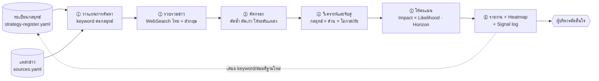
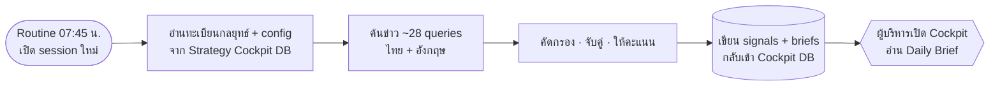

# Strategy Radar — Agentic AI สแกนข่าวและจับคู่กับกลยุทธ์

Agent ที่ดึงข่าวและข้อมูลภายนอก แล้ววิเคราะห์ว่า **กระทบกลยุทธ์ไหน — ในด้านไหน — เป็นโอกาสหรือภัยคุกคาม — รุนแรงแค่ไหน — เมื่อไร — ควรทำอะไร**

## โครงสร้างไฟล์

| ไฟล์ | หน้าที่ | ขึ้น Git? |
|---|---|---|
| `.claude/skills/strategy-radar/SKILL.md` | ขั้นตอนการทำงานของ Agent | ✅ |
| `.claude/skills/strategy-radar/references/scoring-rubric.md` | เกณฑ์จัดประเภทและให้คะแนน | ✅ |
| `.claude/skills/strategy-radar/references/report-template.md` | รูปแบบรายงาน | ✅ |
| `radar/sources.yaml` | แหล่งข่าว ระดับความน่าเชื่อถือ หัวข้อเฝ้าระวังภาพรวม | ✅ |
| `strategies/strategy-register.example.yaml` | ตัวอย่างทะเบียนกลยุทธ์ (บริษัทสมมติ) | ✅ |
| `strategies/strategy-register.yaml` | **ทะเบียนกลยุทธ์จริง** | ❌ (`.gitignore`) |
| `radar/reports/YYYY-MM-DD-radar.md` | **รายงานแต่ละรอบ** | ❌ (`.gitignore`) |
| `radar/signal-log.csv` | **บันทึกสัญญาณสะสม** | ❌ (`.gitignore`) |

## วิธีใช้

1. **เตรียมทะเบียนกลยุทธ์** — คัดลอก `strategies/strategy-register.example.yaml` เป็น `strategies/strategy-register.yaml` แล้วใส่กลยุทธ์จริง
   (สำคัญที่สุดคือ `assumptions` และ `watch.keywords` — คุณภาพของ radar ขึ้นกับสองส่วนนี้)
2. **สั่งรัน** ใน Claude Code ที่เปิด repo นี้:
   - `ใช้ strategy-radar สแกนข่าว 7 วันล่าสุด`
   - `รัน strategy radar เฉพาะกลยุทธ์ P1-S1 แบบ deep`
   - `สแกนข่าวเดือนนี้ว่ากระทบกลยุทธ์ไหนบ้าง`
3. **อ่านรายงาน** ที่ `radar/reports/` และนำสัญญาณระดับ 🔥 Critical / ⚠️ High เข้าวาระประชุม

## การรันอัตโนมัติ (Daily Routine)

Radar ทำงานเป็น **Claude Code Routine ทุกวัน 07:45 น. (เวลาไทย)** — Daily Brief พร้อมอ่านราว 08:00 น.

ทำไมอ่าน/เขียนผ่าน Cockpit DB แทนไฟล์ใน repo:
- Routine เปิด session ใหม่ทุกครั้ง ไฟล์ที่ `.gitignore` ไว้จึงไม่มีใน session นั้น
- repo นี้เป็น public — ทะเบียนกลยุทธ์จริงและผลวิเคราะห์จึงต้องอยู่ในฐานข้อมูลของ Cockpit (artifact ส่วนตัว) เท่านั้น
- prompt ของ Routine เป็นแบบ standalone (ขั้นตอน + เกณฑ์ให้คะแนน + guardrails) ไม่พึ่งไฟล์ใน repo

Collection ที่ Routine ใช้: `strategies` (อ่าน + อัปเดตสถานะสมมติฐาน), `meta/radar` (อ่าน), `signals` (อ่านเพื่อตัดซ้ำ + สร้างใหม่), `briefs` (สร้างรายวัน), `meta/cockpit` (อัปเดต)

## ข้อจำกัดปัจจุบัน

- สภาพแวดล้อม cloud ปัจจุบันจำกัด network: **WebSearch ใช้ได้** แต่ WebFetch (เปิดอ่านต้นฉบับข่าว) และ RSS ถูกบล็อก
  → ถ้าต้องการให้ Agent อ่านต้นฉบับได้ ให้เพิ่มโดเมนข่าวใน Network access ของ environment
- ผลการค้นหาเป็นสรุปจากเครื่องมือค้นหา — สัญญาณระดับ Critical ควรตรวจสอบกับต้นฉบับก่อนตัดสินใจ
